# 《VLSI 芯片设计导论》作业一 

姓名: 刘俊杰 学号: 21307174

截止日期: 2024.7 .1 之前（如有特殊情况可以迟交）

提交方式:

（1）纸质版提交：课堂提交或联系助教线下提交;

（2）电子版提交：将作业文件提交至https://yunbiz.wps.cn/c/collect/cNvAW5WC3Kv。

(作业提交请注意写明姓名与学号，提交方式二者取其一即可，题目相关问题或延迟提交等情况可反馈至zhanglp37@mail2.sysu.edu.cn)

补充说明: 作业的目的是为了扩宽眼界，学习与巩固知识，鼓励交流，但请不要抄袭。题目正确率仅占作业成绩中的一部分，如发现抄袭则记 0 分。

## 基础知识

1. 请写出布尔函数 $F(x, y, z)=x y+\bar{z}$ 的真值表。
**Answer:**

| **x** | **y** | **z** | **F** |
|-------|-------|-------|-------|
| 0     | 0     | 0     | 1     |
| 0     | 0     | 1     | 0     |
| 0     | 1     | 0     | 1     |
| 0     | 1     | 1     | 0     |
| 1     | 0     | 0     | 1     |
| 1     | 0     | 1     | 0     |
| 1     | 1     | 0     | 1     |
| 1     | 1     | 1     | 1     |


2. 请结合以下真值表回答问题:

| $\boldsymbol{x}$ | $\boldsymbol{y}$ | $\boldsymbol{z}$ | $\boldsymbol{F}$ | $\boldsymbol{G}$ |
| :---: | :---: | :---: | :---: | :---: |
| 1 | 1 | 1 | 0 | 0 |
| 1 | 1 | 0 | 0 | 1 |
| 1 | 0 | 1 | 1 | 0 |
| 1 | 0 | 0 | 0 | 0 |
| 0 | 1 | 1 | 0 | 0 |
| 0 | 1 | 0 | 0 | 1 |
| 0 | 0 | 1 | 0 | 0 |
| 0 | 0 | 0 | 0 | 0 |

a) 请写出能够表示布尔函数 $F(x, y, z)$ 的表达式 ${ }^{1}$ 。
**Answer:**
\[F(x, y, z) = x\overline{y}z\] 

b) 请写出能够表示布尔函数 $G(x, y, z)$ 的表达式。
**Answer:**
\[G(x, y, z) = xy\overline{z} + \overline{x}y\overline{z} \]
 \[G(x, y, z) = y\overline{z} \]


3. 请写出以下电路中, 输出 $F$ 的逻辑表达式:[^0]

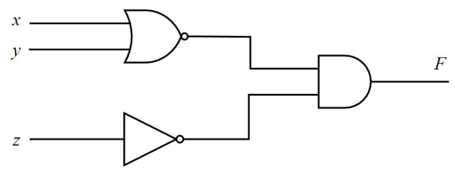

**Answer:**
\[F = \overline{x+y} \overline{z} = \bar{x}\bar{y}\bar{z}\]

## 一、集成电路简介

## 二、MOSFET 工作原理

4. 请回答下列问题[^1] :

a) 请画出作为四端器件的 NMOS 和 PMOS 晶体管的电路符号, 并在图中标注出这些端口。

**Answer**:

**NMOS晶体管:**
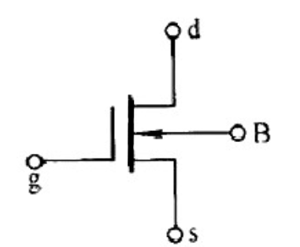

**PMOS晶体管:**
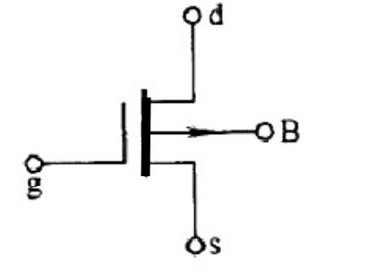


(s:源极 B：衬底 d:漏极 g：栅极)
b) 请写出 MOSFET 的各工作模式以及对应的电压和电流关系。
**Answer:**
1. 截止区 

**条件**: \( V_{GS} < V_{th} \)


**电流关系**:
\[ I_D \approx 0 \]

在截止区，栅极电压 \( V_{GS} \) 小于阈值电压 \( V_{th} \)，因此无法形成导电沟道，漏极电流 \( I_D \) 非常小，接近于零。

2. 线性区 

**条件**: \( V_{GS} > V_{th} \) 且 \( V_{DS} < V_{GS} - V_{th} \)


**电流关系**:
$${I_{DS}=\frac{\mu_nC_{ox}}2\cdot\frac WL\cdot[2(V_{GS}-V_T)V_{DS}-V_{DS}^2]}$$
其中\( W \) 是晶体管宽度，\( L \) 是晶体管长度，\( \mu_n \) 是载流子迁移率，\( C_{ox} \) 是氧化层电容。


在线性区，漏极电流 \( I_D \) 随着 \( V_{DS} \) 增加而增加，同时受 \( V_{GS} \) 的调制。

3. 饱和区 

**条件**: \( V_{GS} > V_{th} \) 且 \( V_{DS} \geq V_{GS} - V_{th} \)

在饱和区，MOSFET 的漏源电压 \( V_{DS} \) 较高，器件工作在恒流源模式，漏极电流 \( I_D \) 不再随 \( V_{DS} \) 增加而明显变化。

**电流关系**:
$${I_D(sat)=\frac{\mu_nC_{ox}}2\cdot\frac WL\cdot(V_{GS}-V_T)^2}$$


在饱和区，漏极电流 \( I_D \) 主要由栅源电压 \( V_{GS} \) 控制，与 \( V_{DS} \) 关系较小。这一区域适用于放大器设计，因为在该区域中，MOSFET 可以提供恒定电流。


c) 请解释速度饱和效应并简要分析其对晶体管工作的影响。

**Answer:**


**速度饱和效应** 是指在高电场下，载流子（电子或空穴）的漂移速度不再线性增加，而是趋于一个最大值，称为饱和速度

当电场强度达到一定值（临界电场 \( E_{sat} \)）时，载流子的速度不再线性增加，而是趋于饱和速度 \( v_{sat} \)：
     \[
     v \approx v_{sat}
     \]

这种现象主要是由于在高电场下，载流子与晶格的散射频率增加，使得它们无法继续加速，从而导致速度饱和。

**对晶体管工作的影响:**

   - 在速度饱和效应显著的情况下，MOSFET 的漏极电流 \( I_D \) 将受到限制，不能像在低电场下那样线性增加。


   - 导通电流减少,由于速度饱和，导通电流减少，影响 MOSFET 的驱动能力。


   - 在短沟道 MOSFET 中，速度饱和效应显著增强。短沟道 MOSFET 的临界电场 \( E_{sat} \) 较低，载流子更容易达到饱和速度，从而限制了电流的增加。


## 三、CMOS 反相器 VTC 特性分析

5. 请画出一个反相器的 VTC 的大致形状, 并在图中标注出不同的工作状态。
**Answer:**
由NMOS和PMOS的不同状态:
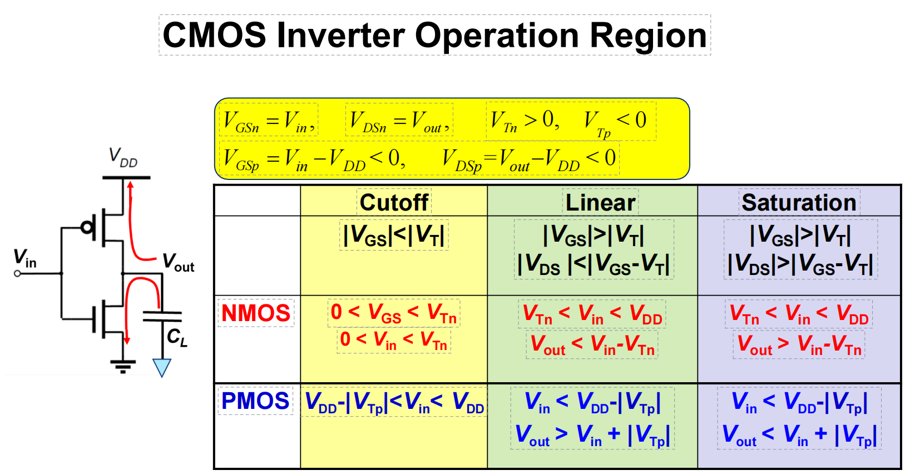
得到
反相器的 VTC :
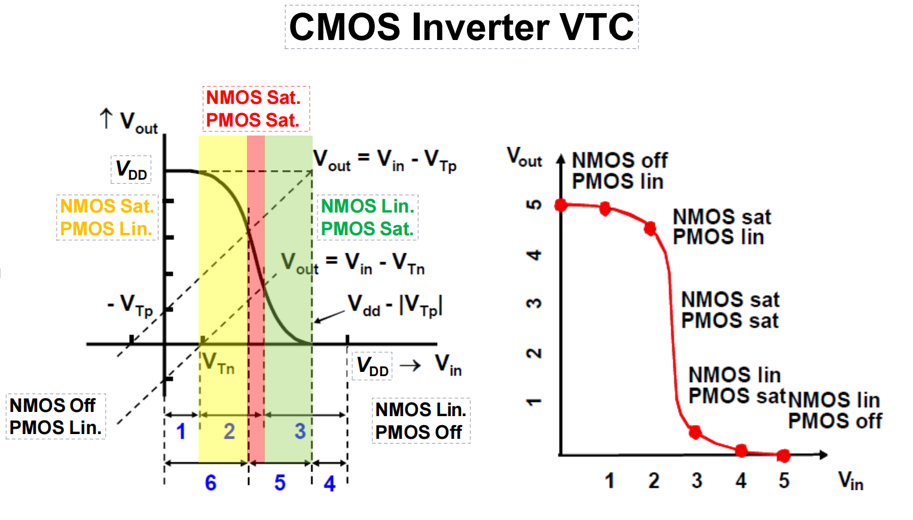

6. 对于噪声容限（Noise Margin）:

a) 请解释噪声以及噪声容限的定义。
**Answer:**

**噪声**:电路中电压和电流不期望的波动
**噪声容限**:系统能够容忍的噪声幅度或波动范围

b) 给定一个反相器的 VTC 图, 如何得到其噪声容限？请举例说明。
**Answer:**

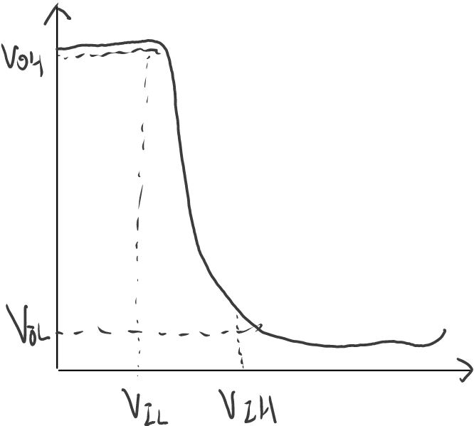

1. **计算高电平噪声容限**：高电平噪声容限（High-level Noise Margin，NM_H）是指在输入电压略微增加时，输出电压仍保持在高电平（接近 V_DD）的最大变化范围。通常用以下公式表示：
   \[
   NM_H = V_{OH} - V_{IH}
   \]
   其中，\( V_{OH} \) 是输出高电平的最小值，\( V_{IH} \) 是输入高电平的最小值。在反相器中，\( V_{OH} \) 通常接近于 V_DD，而 \( V_{IH} \) 是接近于 V_th 的输入电压。

2. **计算低电平噪声容限**：低电平噪声容限（Low-level Noise Margin，NM_L）是指在输入电压略微减少时，输出电压仍保持在低电平（接近 0）的最大变化范围。通常用以下公式表示：
   \[
   NM_L = V_{IL} - V_{OL}
   \]
   其中，\( V_{IL} \) 是输入低电平的最大值，\( V_{OL} \) 是输出低电平的最大值。在反相器中，\( V_{IL} \) 是接近于 V_th 的输入电压，而 \( V_{OL} \) 通常接近于 0。

## 四、CMOS 反相器延时与功耗分析

7. 对于静态 CMOS 反相器:

a) 请画出一个标准反相器的内部构造图, 并标注出晶体管的尺寸比例。
**Answer:**
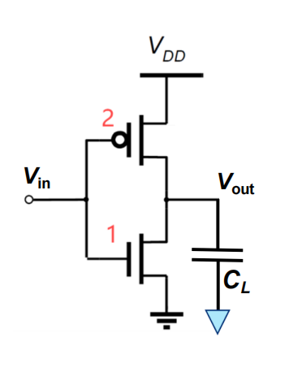
b) 请分析反相器的尺寸变化对电阻, 电容以及延时的影响。
**Answer:**
**尺寸变化对电阻的影响:**
增大W/L,电阻减小
**尺寸变化对电容的影响:**
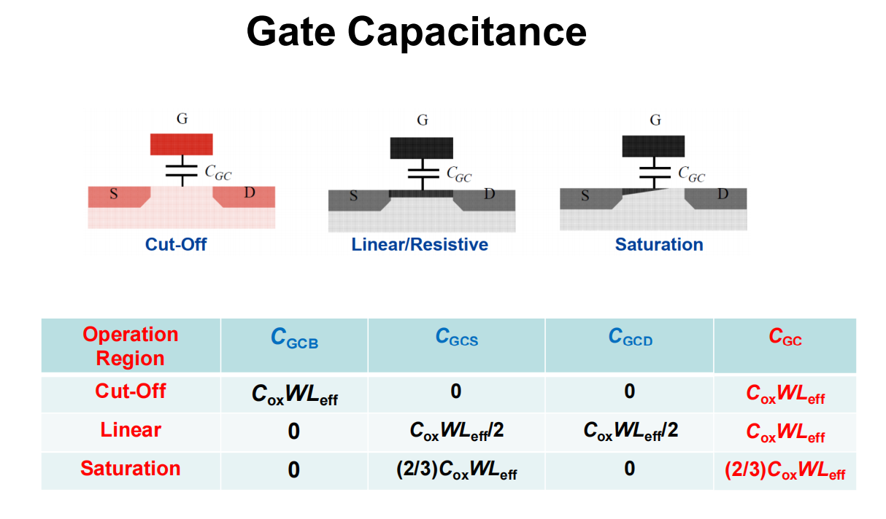
增大W/L,电容增大
**尺寸变化对延时的影响:**
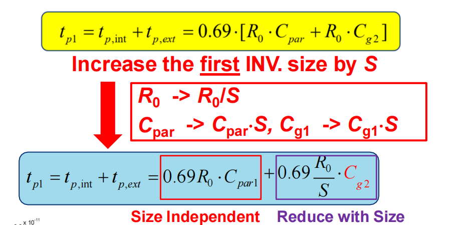
延时取决于 MOSFET 的导通和截止速度，这些速度与 MOSFET 的尺寸、电场分布和载流子迁移有关。

增大 MOSFET 的 W/L 比值通常会减小导通和截止过程中的电阻，从而减小延时。但是，在某些情况下，增大 W/L 比值可能会增加栅极到源漏之间的电容，从而增加延时。

因此，延时的变化不仅取决于电阻的变化，还取决于电容的变化和信号传播的速度
## 五、静态CMOS 逻辑门设计与化化

8. 请根据下述逻辑表达式回答问题:

$$
\text { Out }=\overline{D+A(B+C)}
$$
a) 请设计完成能实现该逻辑功能的静态 CMOS 逻辑门。
**Answer:**
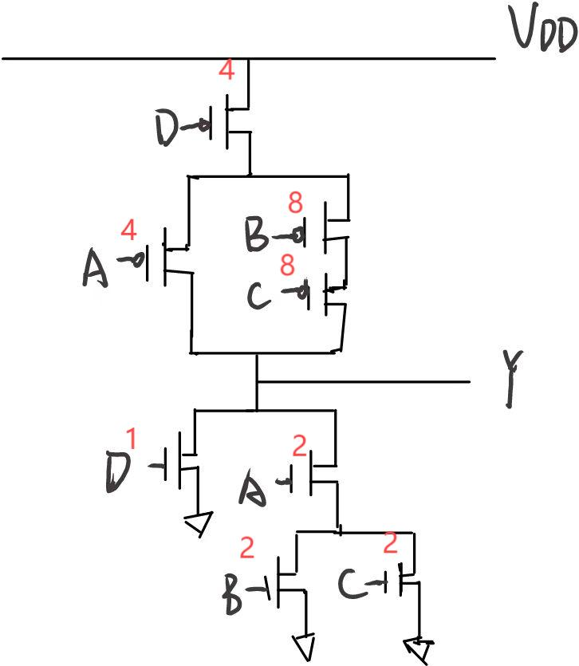
b) 请写出逻辑门延时的计算方法（不包括中间电容）。
**Answer:**
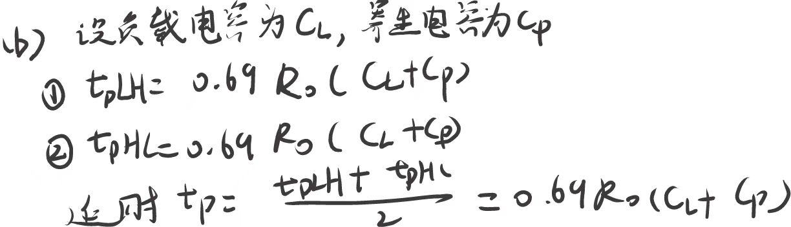
c) 设负载电容为 $\boldsymbol{C}_{\boldsymbol{L}}$, 标准反相器的输入电容和寄生电容分别为 $\boldsymbol{C}_{\boldsymbol{g}, \boldsymbol{0}}$ 和 $\boldsymbol{C}_{\text {par, }, 0}$, 请计算 a) 中得到的逻辑门的传播延时。
**Answer:**
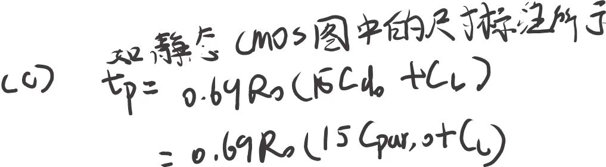
9. 对于一个 2 输入的异或（XOR）门，请回答下列问题:

a)请写出它的真值表, 并使用 SOP (Sum Of Product) 的方法写出它的逻辑表达式。
**Answer:**
**真值表:**
| **x** | **y**  | **F** |
|-------|-------|-------|
| 0     | 0     | 0     |
| 0     | 1     | 1     | 
| 1     | 0     | 1     |
| 1     | 1     | 0     |

**逻辑表达式:**
$$
\text { F }=\overline{x}y + x\overline{y} 
$$

b) 设负载电容为 $\boldsymbol{C}_{L}$, 标准反相器的输入电容和寄生电容分别为 $\boldsymbol{C}_{g, 0}$ 和 $\boldsymbol{C}_{\text {par,0 }}$, 请计算它的传播延时。
**Answer:**
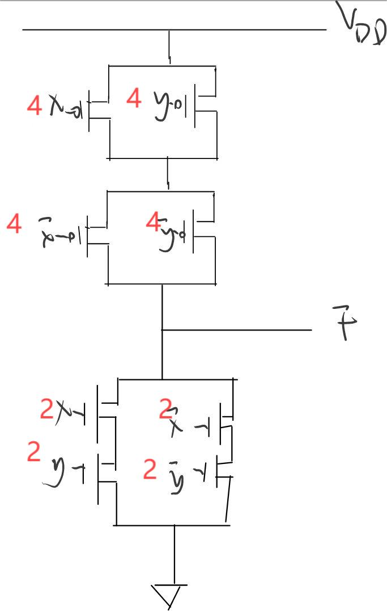
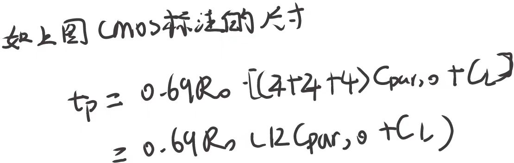
c) 对于该门的两个输入 $A$ 与 $B$, 假设 $P_{A=1}=1 / 3, P_{B=1}=1 / 2$, 请计算该门的切换功耗。

**Answer:**
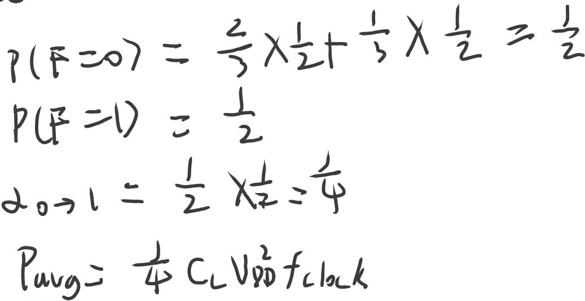
10.   对于一个 2 输入的同或（XNOR）门, 请回答下列问题:

a) 请设计出能完成其功能的静态 CMOS 逻辑门。
**Answer:**

首先写出真值表和逻辑表达式:
**真值表:**
| **x** | **y**  | **F** |
|-------|-------|-------|
| 0     | 0     | 1     |
| 0     | 1     | 0     | 
| 1     | 0     | 0     |
| 1     | 1     | 1     |

**逻辑表达式:**
$$
\text { F }=\overline{x}  * \overline{y}  +   xy  = \overline{x \overline{y}+ \overline{x}y}
$$

由
$$
\text { F }= \overline{x \overline{y}+ \overline{x}y}
$$
得到:


**静态 CMOS 逻辑门**
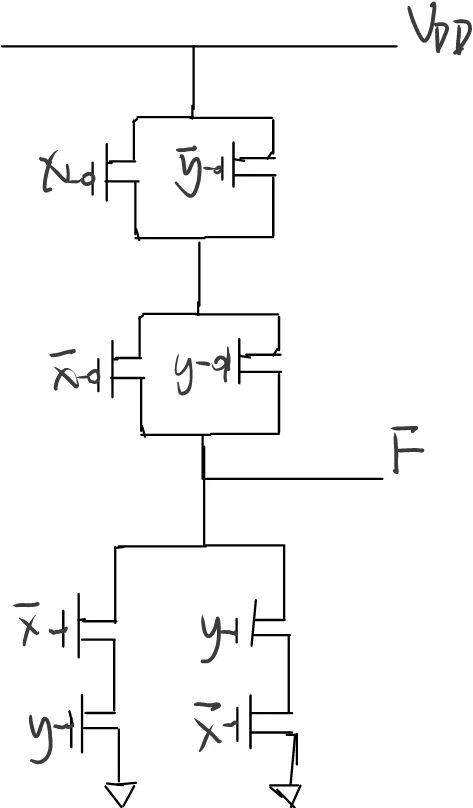

(上图中省略了对x、y使用反相器得到的$\overline{x}$ 、 $\overline{y}$的CMOS部分)

b) 对于该门的两个输入 $A$ 与 $B$, 假设 $P_{A=1}=1 / 3, P_{B=1}=1 / 2$, 请计算该门的切换功耗。
**Answer:**
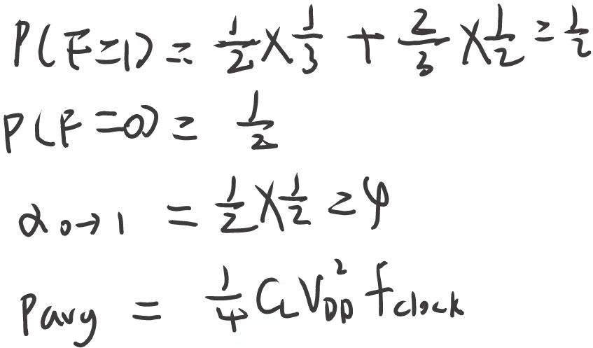
11.   请根据下列逻辑表达式回答问题:

$$
\text { out }=(A \bar{B}+C) D
$$

a) 请设计完成能实现该逻辑功能的静态 CMOS 逻辑门。
**Answer:**

$$
\text { out }=(A \bar{B}+C) D
$$

=

$$
\text { out }=\overline{\bar{D}+\bar{A}\bar{C}+B\bar{C}}
$$

**静态 CMOS 逻辑门:**
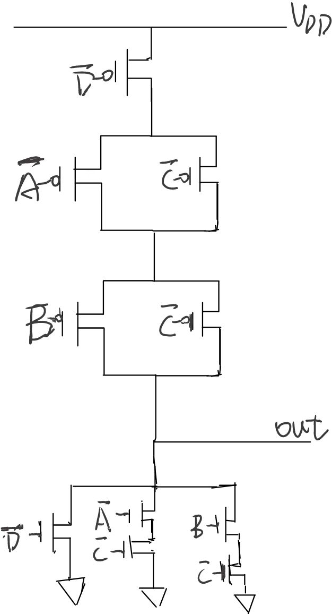
b) 请使用与 a)不同的方案实现同样具有逻辑功能的静态 CMOS 逻辑门。

**设计方案:**

在$\overline{out}$后加一个反相器
$\overline{out} = \overline{(A \bar{B}+C) D}$
**静态 CMOS 逻辑门:**
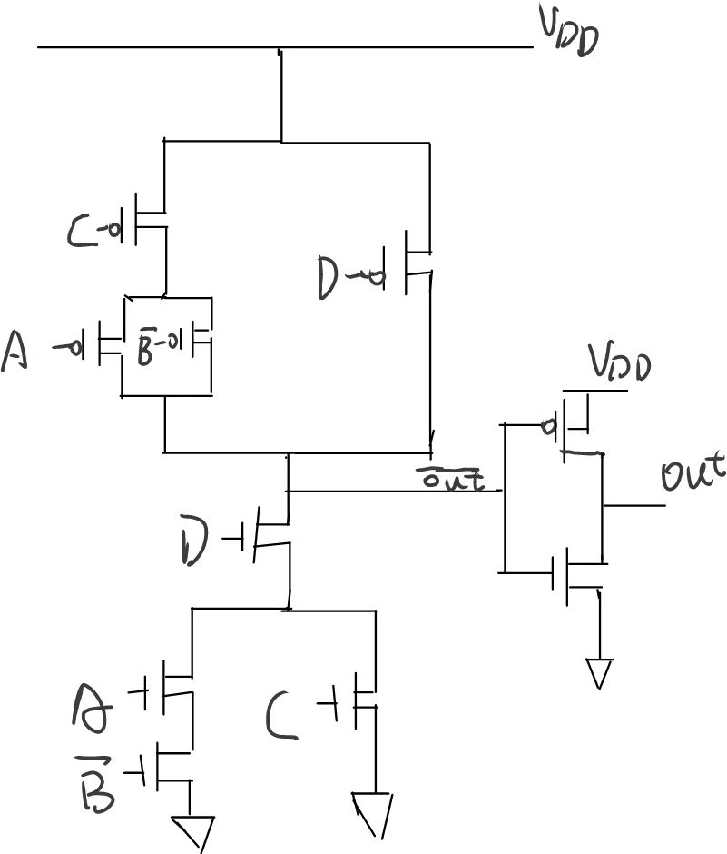


12.   下图是一个 2 输入的同或 (XNOR) 门的符号表示, 请回答下列问题:

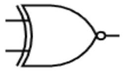

a) 请写出它的真值表以及逻辑表达式。
**Answer:**
真值表:

| 输入A (A) | 输入B (B) | 输出 (Y) |
|:---------:|:---------:|:--------:|
|     0     |     0     |     1    |
|     0     |     1     |     0    |
|     1     |     0     |     0    |
|     1     |     1     |     1    |

逻辑表达式

同或门的逻辑表达式可以用如下方式表示：

\[ Y = A \cdot B + \overline{A} \cdot \overline{B} = \overline{A \oplus B} = \overline{\bar{A}B+A\bar{B}} \]

b) 请使用静态 CMOS 电路实现该逻辑门。
**Answer:**

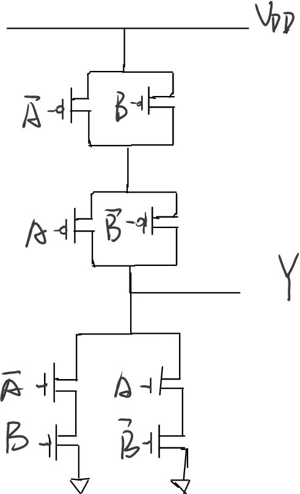

13.  对于多输入的异或 (XOR)门该如何工作, 向来众说纷纭。有人将其称为 “奇数功能或门”, 即当奇数个输入为高电平时, 其输出为高电平。请回答下列问题:

a) 请写出使用以上定义实现的 3 输入 XOR 门的真值表并设计出能实现其逻辑功能的静态 CMOS 电路。
**Answer:**
**真值表 :**
| **A(输入)** | **B(输入)** | **C(输入)** | **Out(输出)** |
|---|-------|-------|-------|
| 0     | 0     | 0     | 0     |
| 0     | 0     | 1     | 1     |
| 0     | 1     | 0     | 1     |
| 0     | 1     | 1     | 0     |
| 1     | 0     | 0     | 1     |
| 1     | 0     | 1     | 0     |
| 1     | 1     | 0     | 0     |
| 1     | 1     | 1     | 1     |

**逻辑表达式:**
\[ out = \overline{\bar{A}\bar{B}\bar{C} + A\bar{B}\bar{C} + A\bar{B}C + AB\bar{C} }   \]

= \[  \overline{\bar{B}\bar{C} + A\bar{B}C + AB\bar{C} }   \]

= \[  \overline{\bar{B}(AC + \bar{C}) + AB\bar{C} }   \]

= \[  \overline{\bar{B}(A + \bar{C}) + AB\bar{C} }   \]

= \[  \overline{A\bar{B} + \bar{B}\bar{C} + AB\bar{C} }   \]

= \[  \overline{A\bar{B} + \bar{C}(\bar{B} + AB) }   \]

= \[  \overline{A\bar{B} + \bar{C}(\bar{B} + A) }   \]

= \[  \overline{A\bar{B} + \bar{B}\bar{C} + A\bar{C} }   \]
**静态CMOS电路:**
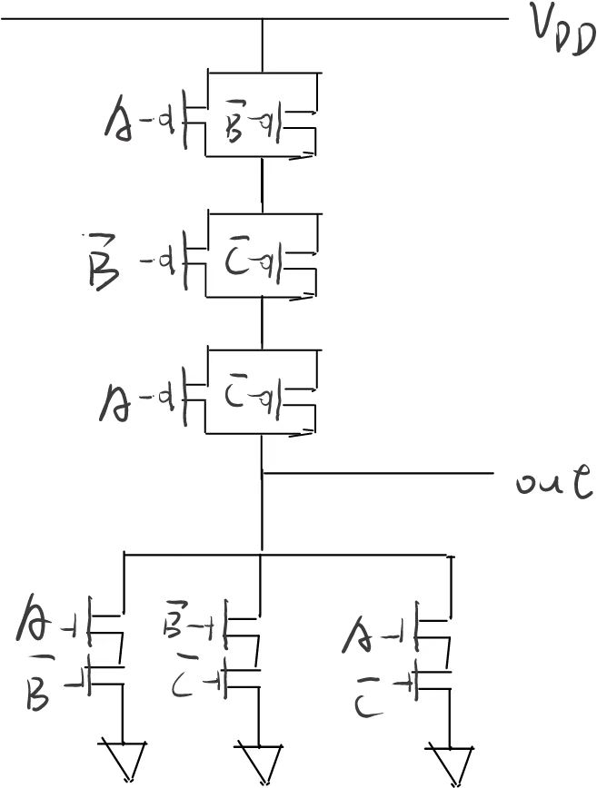
b) 你认同这种定义吗? 你认为多输入的 XOR 门应该实现什么样的逻辑功能?
**Answer:**

我认同这种定义,因为这样的定义符合多个输入异或的逻辑运算规则。

14.  （数字逻辑相关）请回答下列问题:

a) 什么是逻辑运算的最小完全集?

**Answer:**
逻辑运算的最小完全集指的是一组逻辑运算，通过该组逻辑运算可以构造出所有可能的布尔函数。也就是说，使用这些逻辑运算可以表达任何逻辑电路。最小完全集是因为这些运算是不可再减少的，否则就不能表达所有的布尔函数。

b) $\{$ 与, 或, 非 $\}$ 是一个最小完全集吗？\{与非，或非\}呢?


**Answer:**

集合 \(\{ \text{与, 或, 非} \}\) 是最小完全集。因为这三个基本运算是逻辑电路设计中最基础的运算，通过它们可以组合出任何布尔函数。因此，集合 \(\{ \text{与, 或, 非} \}\) 确实是一个最小完全集。所有其他的布尔运算（如 XOR, NAND, NOR 等）都可以通过这三个运算来实现。

集合 \(\{ \text{与非, 或非} \}\) 也是最小完全集。因为能通过它们组合出所有其他的基本运算（即 AND, OR, NOT）:

1. **NOT 运算通过 NAND 实现**：
   \[
   \overline{A} = A \text{ NAND } A
   \]

2. **NOT 运算通过 NOR 实现**：
   \[
   \overline{A} = A \text{ NOR } A
   \]

一旦有了 NOT 运算，就可以通过 NAND 或 NOR 实现 AND 和 OR 运算：

3. **AND 运算通过 NAND 实现**：
   \[
   A \cdot B = \overline{A \text{ NAND } B}
   \]
   即，先做 NAND 运算，然后对结果取反。

4. **OR 运算通过 NOR 实现**：
   \[
   A + B = \overline{A \text{ NOR } B}
   \]
   即，先做 NOR 运算，然后对结果取反。

所以集合 \(\{ \text{与非, 或非} \}\) 也是最小完全集。

c) 请使用 NAND 门与 NOR 门实现 AND, OR 与 INV 门, 再使用 AND, OR 与 INV 门实现 NAND 门与 NOR 门（２输入）。
**Answer:**

**实现 AND、OR 和 INV 门**：

**使用 NAND 门实现 AND 门**：
。

1. **AND 门的实现**：
   ```
   A ∧ B = (A NAND B) NAND (A NAND B)
   ```
   这里，`(A NAND B)` 表示 NAND 门的输出。

   - 输入 A 和 B 到第一个 NAND 门，得到 `(A NAND B)`。
   - 将 `(A NAND B)` 的输出再次输入到第二个 NAND 门，得到最终的 AND 门输出。

**使用 NAND 门实现 OR 门**：


2. **OR 门的实现**：
   ```
   A ∨ B = (A NAND A) NAND (B NAND B)
   ```
   - 输入 A 到两个 NAND 门，得到 `(A NAND A)`。
   - 输入 B 到两个 NAND 门，得到 `(B NAND B)`。
   - 将 `(A NAND A)` 和 `(B NAND B)` 的输出分别输入到第三个 NAND 门，得到最终的 OR 门输出。

**使用 NAND 门实现 INV 门（NOT 门）**：


3. **INV 门的实现**：
   ```
   NOT A = A NAND A
   ```
   - 将输入 A 输入到一个 NAND 门两次，得到最终的 INV（NOT）门输出。

**使用 AND、OR 和 INV 门实现 NAND 和 NOR 门**：

**使用 AND 和 INV 门实现 NAND 门**：


1. **NAND 门的实现**：
   ```
   A NAND B = NOT (A ∧ B) = (A ∧ B)' = ((A NAND B) NAND (A NAND B)) NAND ((A NAND B) NAND (A NAND B))
   ```
   - 首先使用前面实现的 AND 门来实现 `(A ∧ B)`。
   - 然后将 `(A ∧ B)` 输入到两个 NAND 门，得到 `(A NAND B)`。
   - 将 `(A NAND B)` 的输出再次输入到两个 NAND 门，得到最终的 NAND 门输出。

**使用 OR 和 INV 门实现 NOR 门**：


2 . **NOR 门的实现**：
   ```
   A NOR B = NOT (A ∨ B) = (A ∨ B)'
   ```
   - 首先使用前面实现的 OR 门来实现 `(A ∨ B)`。
   - 将 `(A ∨ B)` 输入到一个 NAND 门，得到 `(A NOR B)`。


15.    请根据下述逻辑表达式回答问题:

$$
\text { Out }=\overline{A B C+\bar{A} B+B \bar{C}+A C}
$$

a) 该表达式能否进一步化简？请写出化简后的表达式。
**Answer:**

$$
\text { Out }=\overline{A B C+\bar{A} B+B \bar{C}+A C}
$$

= 

$$
\text { Out }=\overline{B (A C+\bar{A} )+B \bar{C}+A C}
$$

=

$$
\text { Out }=\overline{B (C+\bar{A} )+B \bar{C}+A C}
$$

=

$$
\text { Out }=\overline{ B C+\bar{A} B+B \bar{C}+A C}
$$

=

$$
\text { Out }=\overline{B+\bar{A} B+A C}
$$

=

$$
\text { Out }=\overline{B+A C}
$$

b) 根据原表达式或者 a) 中得到的结果, 实现对应的静态 CMOS 逻辑门。
**Answer:**
**a)中结果对应的静态 CMOS 逻辑门:**
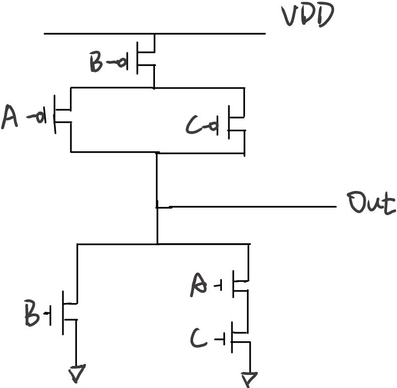
16. 请结合以下真值表回答问题:

| $\boldsymbol{A}$ | $\boldsymbol{B}$ | $\boldsymbol{Y}$ |
| :---: | :---: | :---: |
| 0 | 0 | 0 |
| 0 | 1 | 0 |
| 1 | 0 | 1 |
| 1 | 1 | 1 |

a) 请根据真值表写出对应的逻辑表达式。

**Answer:**
 \[Y = A\] 

b) 请根据逻辑表达式实现对应的静态 CMOS 电路。
**Answer:**

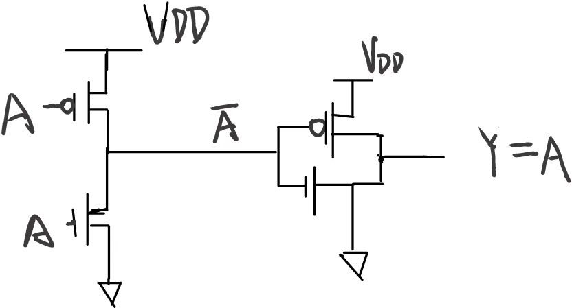
17.  对于一个 4 输入的 NAND 门:

a) 请写出其逻辑表达式。
**Answer:**


**逻辑表达式:**
$$
\text { F }=\overline{abcd}  
$$


b) 使用互补 CMOS 设计将其实现, 需要多少个 NMOS 晶体管?
**Answer:**

需要4个 NMOS 晶体管

18.  请解释静态 CMOS 电路中为什么使用 PMOS 晶体管实现 PUN 部分, 使用 NMOS 实现 PDN 部分？若是互相替换会导致什么后果？


**Answer:**

当NMOS用在PDN时，由于对于NMOS，VDS>=0，所以Source接地，Drain接output的负载电容，由于VGS始终为Vdd>Vtn，所以它始终导通，负载电容可以一直放电到输出电压为0，也就是他可以实现一个strong 0

当NMOS用在PUN时，由于对于NMOS，VDS>=0，所以Source接output的负载电容，Drain接VDD，由于电源对负载电容进行充电，输出端端的电压逐渐增大，VGS对应减小，当它小于Vtn时，不再有导电沟道，NMOS断开，因此，输出端只能充电到VDD-Vtn，它只能实现一个弱1

当PMOS用在PDN时，由于对于PMOS，VDS<=0，所以Drain接地，Source接output的负载电容，由于随着负载电容放电，输出端的电压逐渐减小，VGS的绝对值对应减小，当它小于Vtp的绝对值时，不再有导电沟道，PMOS断开，因此，输出端只能放电到Vtp的绝对值，它只能实现一个弱0

当PMOS用在PUN时，由于对于PMOS，VDS<=0，所以Drain接output的负载电容，Source接VDD，由于VGS的绝对值始终为Vdd>Vtp的绝对值，所以它始终导通，负载电容可以一直充电到输出电压为Vdd，也就是他可以实现一个strong 1


19.  请结合下图回答问题:


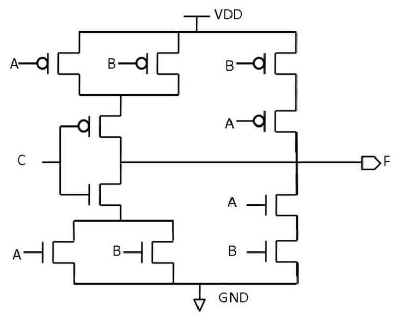

a) 图中的电路实现了什么样的逻辑功能？请写出其逻辑表达式。
**Answer:**

**实现的逻辑功能:**

实现了获得全加器的进位的取反,再接一个反相器就是全加器的进位

**逻辑表达式:**
$$
\text { F }=\overline{C(A+B) + AB} 
$$


b) 这是一个静态 CMOS 电路吗? 为什么?


**Answer:**

是静态电路，因为每一时刻每个门的输出通过一个低阻路径连到VDD或GND上。同时在任何时候该门的输出即为该电路实现的布尔函数值（忽略在切换期间的瞬态效应）。

但是感觉不是静态 CMOS 电路,因为感觉PMOS和NMOS并不互补。


20.    请结合下图回答问题:

.jpg)

a) 该图中的 CMOS 电路实现了什么样的逻辑功能? 请写出其逻辑表达式。
**Answer:**
**逻辑功能:**
实现了三输入的与非门
**逻辑表达式**
$$
\text { out }=\overline{A_{1}A_{2}A_{3}} 
$$


b) 假设该电路之前的状态为: $A_{1}=0, A_{2}=1, A_{3}=1$, 请写出稳定时电路中几个电容的充放电状态。这时候如果 $\boldsymbol{A}_{\boldsymbol{1}}$ 的状态由 0 变为 1 , 电容中的电荷会发生什么样的变化?

**Answer:**

稳定时电路中几个电容的充放电状态:
$C_{1},C_{2},C_{L}$ 都在充电

$\boldsymbol{A}_{\boldsymbol{1}}$ 的状态由 0 变为 1 , 电容中的电荷会发生变化:

$C_{1},C_{2},C_{L}$ 放电


c) 结合 b) 中的情况, 如果输入中只有 $\boldsymbol{A}_{1}$ 会频繁地发生变化, 该电路的设计可能会导致什么问题？能否进行优化?
**Answer:**

**问题:**
$\boldsymbol{A}_{1}$ 会频繁地发生变化那么三个电容会在充电和放电两个状态中间频繁切换,从而导致时延增加。

**优化:**

将$\boldsymbol{A}_{1}$和$\boldsymbol{A}_{3}$位置对换,这样只会有$C_{L}$会受到$\boldsymbol{A}_{1}$频繁变化的影响。

## 六、Logical Efforts 分析方法介绍与应用

21. （基础回顾）对于下图所示的静态 CMOS 逻辑门，请回答:

.jpg)

a) 如何计算它的传播延时？请写出其传播延时的计算公式。
**Answer:**

传播延时：
\[ t_p = R \cdot (C_L + C_{\text{par},g} ) \]


b)图中的$C_{inl,g}\text{、}C_{par,g}\text{,}C_L$个代表了什么?
**Answer:**


- \( C_{\text{in1},g} \) 是反相器的栅极电容。
- \( C_{\text{par},g} \) 是反相器的扩散电容。
- \( C_L \) 下一级逻辑门的栅极电容。


c) 如果将该门中所有晶体管的尺寸增大或缩小 $S$ 倍, 会对它的等效电阻和电容造成什么样的影响?


**Answer:**
所有晶体管的尺寸增大 $S$ 倍 ,等效电阻减小$S$倍、 \( C_{\text{in1},g} \) 和\( C_{\text{par},g} \)增大$S$倍， \( C_L \)不变。
所有晶体管的尺寸减小 $S$ 倍 ,等效电阻增大$S$倍、 \( C_{\text{in1},g} \) 和\( C_{\text{par},g} \)减小$S$倍，\( C_L \)不变。

1.  (Gate Sizing) 假设一个标准反相器的等效电阻为 $R_{I N V}$, PMOS 的 $W / L=2$, NMOS 的 $W / L=1$, 输入电容 (input capacitance) 为 $C_{i n, I N V}$, 寄生电容 (parasitic capacitance) 为 $C_{\text {par, INV }}$ 。同时假设负载电容为 $C_{L}$, 请回答下列问题:

d) 对于一个 2 输入的 NAND门, 请使用静态 CMOS 方法将其实现, 为其分配合适的尺寸使得其等效电阻等于 $R_{I N V}$, 并计算它的传播延时。
**Answer:**
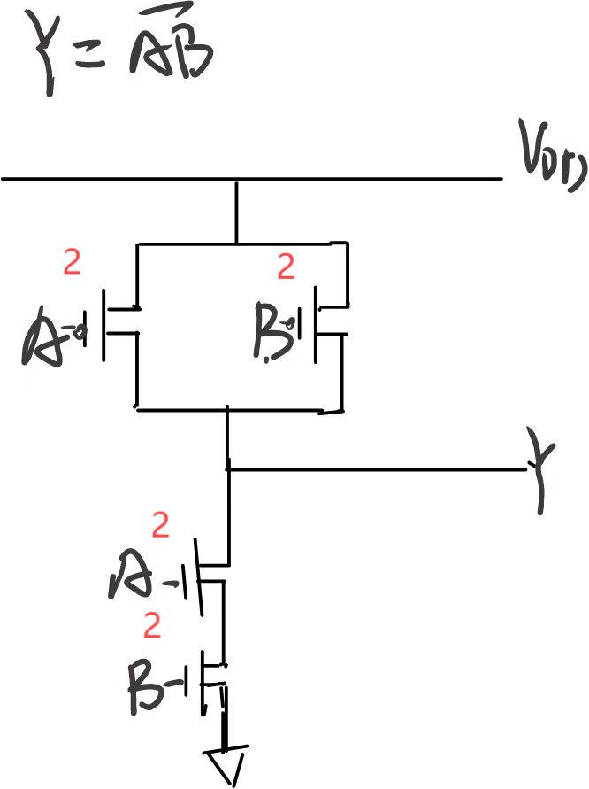

传播延时: $$t_{p}=0.69 R_{INV}(6C_{\text {par, INV }}+ C_{L})$$
e) 对于一个 2 输入的 NOR 门, 请使用静态 CMOS 方法将其实现, 为其分配合适的尺寸使得其等效电阻等于 $R_{I N V}$, 并计算它的传播延时。
**Answer:**
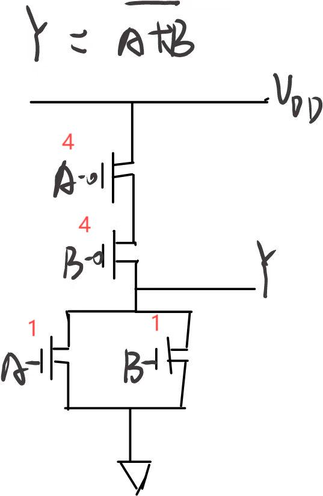
传播延时: $$t_{p}=0.69 R_{INV}(6C_{\text {par, INV }}+ C_{L})$$
f) 对于一个 2 输入的 XOR 门, 请使用静态 CMOS 方法将其实现, 为其分配合适的尺寸使得其等效电阻等于 $R_{I N V}$, 并计算它的传播延时。
**Answer:**
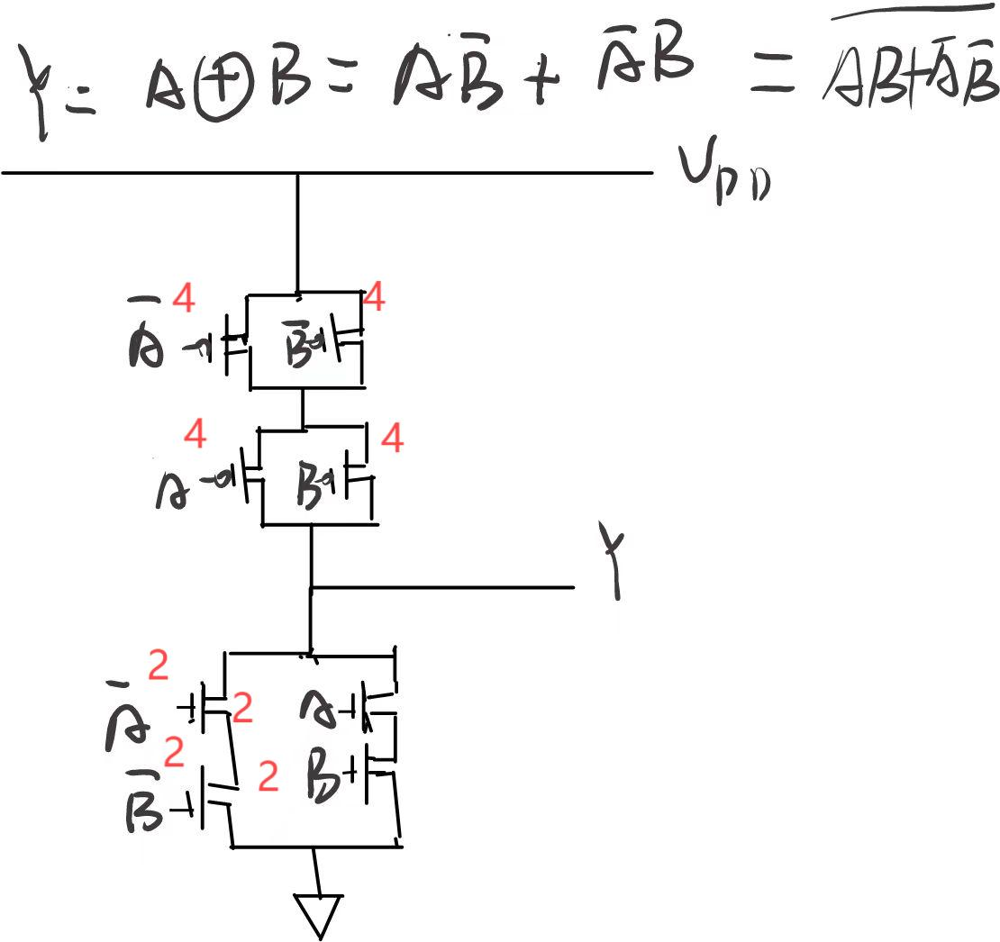
传播延时: $$t_{p}=0.69 R_{INV}(12C_{\text {par, INV }}+ C_{L})$$
23. (Logical Effort) 下图是一个多级组合逻辑电路的示例, 请回答以下问题:

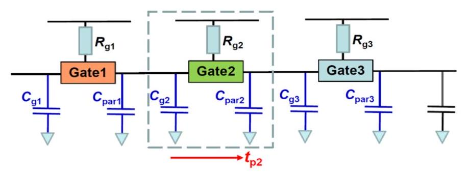

g）如何计算多级组合逻辑电路的传播延时？请用自己的语言描述大致计算流程。

**Answer:**

$t_p=\sum0.69R_{g,i}\cdot[C_{par,i}+C_{g,i+1}]$
要计算总的delay，需针对每一级具体的逻辑功能计算Cg和Cp。

h) 如何使用 Logical Effort 方法计算多级组合逻辑电路的传播延时？请推导出其计算公式。
**Answer:**

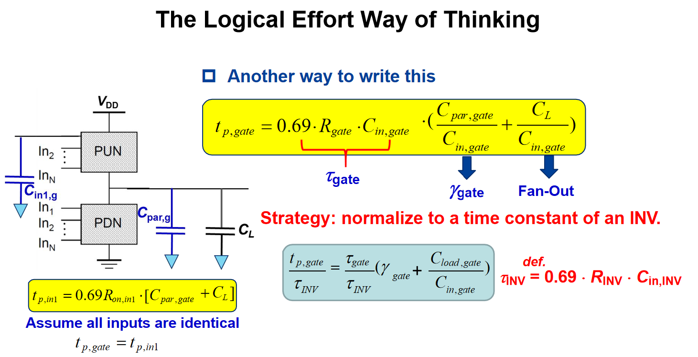
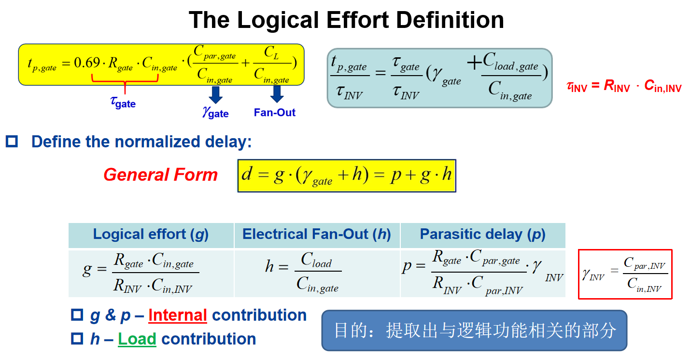
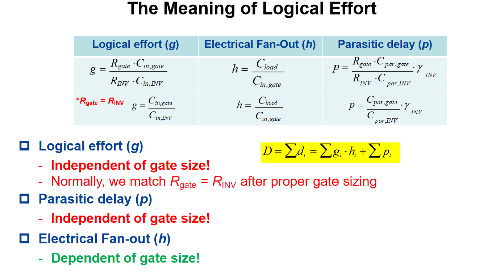
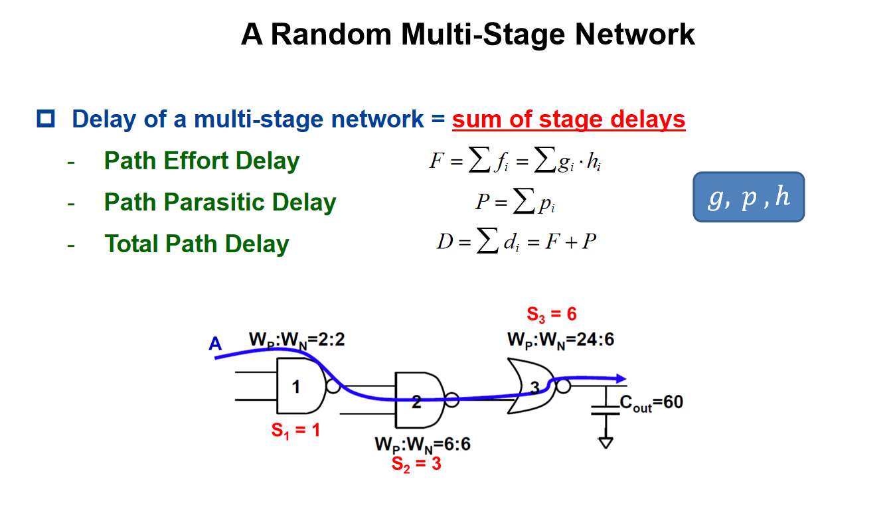
i) Logical Effort 方法中的电气扇出 $h$, 逻辑努力 $g$ 和本征延时 $p$ (Intrinsic Delay/Parasitic Delay）代表了什么内涵？请写出它们的计算方法以及你对它们的理解。

**Answer:**


**1. 电气扇出 \( h \)**

电气扇出是指逻辑门所驱动的负载电容与其自身的输入电容的比值。它反映了逻辑门在驱动负载时的难度。

**计算方法**：
\[ h = \frac{C_{\text{out}}}{C_{\text{in}}} \]
其中：
- \( C_{\text{out}} \) 是逻辑门的负载电容，即该逻辑门输出所连接的所有电容（包括下一级门的输入电容和互连电容）。
- \( C_{\text{in}} \) 是逻辑门的输入电容。
：
- 电气扇出 \( h \) 越大，表示逻辑门驱动的负载越大，因而延时越大。
- \( h \) 是电路设计中决定门尺寸和性能的重要参数，优化电气扇出可以有效降低电路延时。

**2. 逻辑努力 \( g \)**


逻辑努力衡量了逻辑门实现其功能的复杂性。具体而言，它是该逻辑门在实现某一逻辑功能时所需要的输入电容与相同驱动能力的反相器输入电容的比值。

**计算方法**：
\[ g = \frac{C_{\text{in}}^{\text{gate}}}{C_{\text{in}}^{\text{inv}}} \]
其中：
- \( C_{\text{in}}^{\text{gate}} \) 是逻辑门的输入电容。
- \( C_{\text{in}}^{\text{inv}} \) 是具有相同驱动能力的反相器的输入电容。


- 逻辑努力 \( g \) 反映了实现特定逻辑功能的成本。对于给定的负载电容和电气扇出，逻辑努力越大，延时越大。
- 不同类型的逻辑门（如 NAND、NOR 等）具有不同的逻辑努力。

**3. 本征延时 \( p \)**

- 本征延时，也称为寄生延时，是逻辑门由于其内部结构和寄生电容导致的固有延时。它不依赖于负载电容，反映了逻辑门的固有延时特性。

**计算方法**：
\[ p = p_{\text{gate}} \]
其中：
- \( p_{\text{gate}} \) 是逻辑门的本征延时常数，通常由实验或仿真得到。

- 本征延时 \( p \) 是逻辑门固有的延时特性，不随负载变化而变化。
- 本征延时在 CMOS 电路设计中是一个常数，代表了逻辑门在无负载情况下的延时。

j）请补充下表的内容（计算逻辑努力 $g$ ):

**Answer:**
| 类型 | 输入数量 $\boldsymbol{g} \boldsymbol{g}$ |  |  |  |  |
| :---: | :---: | :---: | :---: | :---: | :---: |
|  | 1 | 2 | 3 | 4 | $\mathrm{n}$ |
| NAND |  | 4/3 | 5/3 | 2 | (n+2)/3 |
| NOR |  | 5/3 | 7/3 | 3 | (2n+1)/3 |
| MUX |  | 2 | 2 | 2 | 2  |
| XOR, XNOR |  | 4 | 12 | 32 |  |

k) 请补充下表内容(计算本征延时 $p$ )

**Answer:**
| 类型 | Intrinsic Delay/Parasitic Delay $(p)$ |
| :---: | :---: |
| INV | 1 |
| n-input NAND | n |
| n-input NOR | n |
| n-way multiplexer | 2n |
| XOR, XNOR | n$2^{n-1}$ |

24.  （反相器链）设标准反相器的等效电阻为 $R_{I N V}$, 请计算出下图所示的反相器链的传播延时。

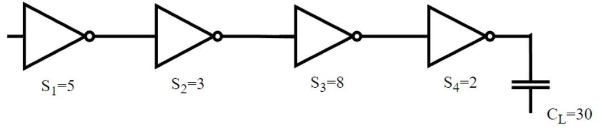

**Answer:**

$$t_{p}=\sum_{i=1}^{n}t_{pi}=\sum_{i=1}^{n}0.69R_{INV}\left[C_{pax,0}+\frac{S_{i+1}}{S_{i}}C_{in,0}\right]$$

= 0.69$R_{INV}$(24+33+30+36)

= 84.869$R_{INV}$


25.  （传播延时） “提出问题往往比解决问题更重要”, 对于下图所示例题, 如果只给出所有门的 $W_{P}: W_{N}$, 能否计算出正确结果？如果只给出 $\mathrm{S}$, 能否计算? 如果只给出反相器的构造信息, 能否计算? 请根据图中的条件使用传统方法计算该电路的传播延时。

**Answer:**
$W_{P}: W_{N}$和$\mathrm{S}$都能。

## Example: Delay of Multi-Stage Network

.jpg)
**Answer:**
$$t_{p}=\sum_{i=1}^{n}t_{pi}=\sum_{i=1}^{n}0.69R_{INV}\left[C_{pax,0}+\frac{S_{i+1}}{S_{i}}C_{in,0}\right]$$

= 0.69$R_{INV}$(24+33+30+36)

= 84.869$R_{INV}$
26.  请使用逻辑努力（Logical effort）方法计算上图中的例题。
   
**Answer:**
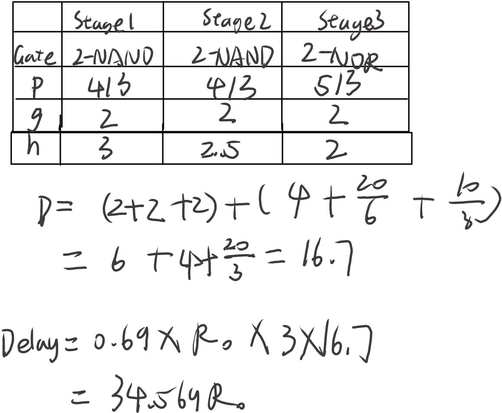
27.   对于下图所示电路, 请计算出当传播延迟最小时, 每一级电路的晶体管尺寸大小（假设对于单位宽度晶体管, $\mathrm{C}_{\mathrm{g}}=1, \mathrm{C}_{\mathrm{par}}=1$ )。

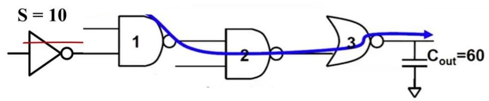


**Answer:**

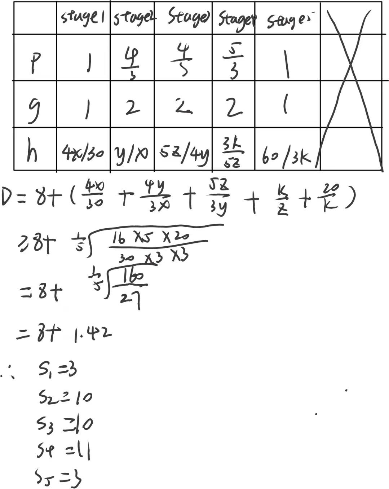


[^0]:    ${ }^{1}$ 提示: 可尝试使用 SOP (Sum Of Products) 的表达

[^1]:    ${ }^{2}$ 此类型题目的目的为知识回顾, please don't panic, 考试中不会出现复杂知识点以及公式的默写

