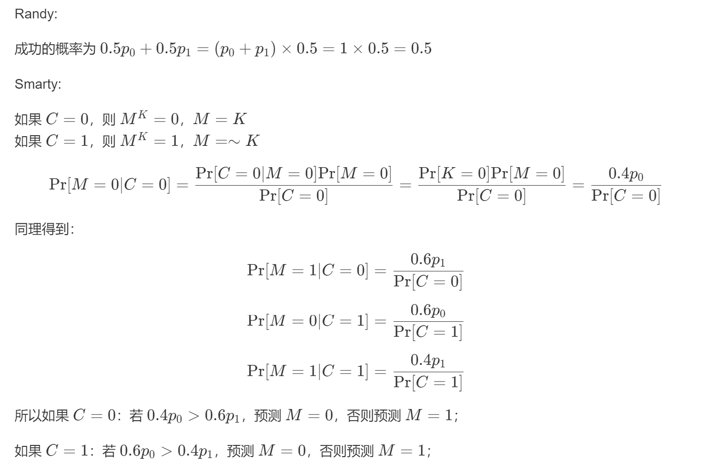
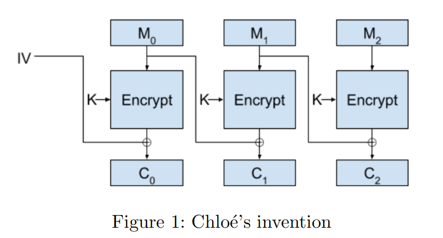
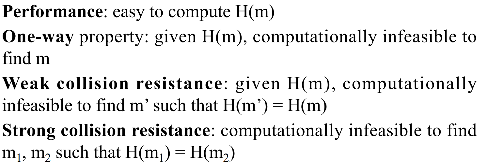

# Computer and Network Security: Homework 1 
学号|21307174|姓名|刘俊杰
-|-|-|-
**专业**|**计算机科学与技术**|**Email**|**liujj255@mail2.sysu.edu.cn**|
## Instructions

- Please answer 5 of the 6 problems. All questions are weighted equally.
- Please send your solution to $2160853158 @ q q . c o m$ by May 22 midnight.

## Problem 1 Vigenère Cipher. 
Suppose you have a language with only the 3 letters A, B, C, and they occur with frequencies $0.7,0.2$, and 0.1 . The following ciphertext was encrypted by the Vigenère cipher:

$$
A B C B A B B B A C .
$$

Suppose you are told that the key length is 1,2 , or 3 . Show that the key length is probably 2 , and determine the most probable key.
### Answer:
$$
A B C B A B B B A C .
$$
首先观察密文,使用**Kasiski方法**发现其中有重复的字母组**BA**,该重复字母组的距离为**4**,由于题目给出密文长度只能为1或2或3,**4**的约数有1、2、4,所以**密钥长度最可能是2**.

在**长度最可能是2**的基础上推出密钥:

$$
A B | C B | A B | B B | A C .
$$
将密文2个字母一组分组,在每组第1个位置字母出现的频率:
$$
A: 0.6\qquad
B: 0.2 \qquad
C:0.2
$$
在每组第1个位置字母出现的频率:
$$
A: 0.0 \qquad
B: 0.8 \qquad
C:0.2
$$
题目给出原文中字母出现的频率:
$$
A: 0.7 \qquad
B: 0.2 \qquad
C:0.1
$$
所以极大概率第一个位置密钥为**A**,第二个位置密钥为**B**

**综上,密钥长度大概率为2,密钥大概率为(A,B)**

## Problem 2 Perfect secrecy and one-time-pad.

1. For a perfect secret encryption scheme $E(K, M)=C$, prove: $\operatorname{Pr}[C=c \mid M=m]=\operatorname{Pr}[C=c]$.
2. Consider a biased one-time-pad system, where $\operatorname{Pr}[M=b]=p_{b}, b=0,1$ and $\operatorname{Pr}[K=0]=0.4$. The first attacker Randy randomly guesses $M=0$ or $M=1$ : prove that the probability of success is 0.5 . The second attacker Smarty guesses $M$ based on $C$ and $p_{0}, p_{1}$ : suggest a good attack strategy.
### Answer:
1.因为是perfect secret encryption scheme，所以有
$\operatorname{Pr}[M=m \mid C=c]=\operatorname{Pr}[M=m]$

由贝叶斯定理，可以得到：$\operatorname{Pr}[M=m \mid C=c]$ = 
$\operatorname{Pr}[C=c \mid M=m]$  * 
$\operatorname{Pr}[M=m ]$ / 
$\operatorname{Pr}[ C=c]$

故 
$\operatorname{Pr}[C=c \mid M=m]$ * 
 $\operatorname{Pr}[M=m ]$  / 
 $operatorname{Pr}[ C=c]$ = 
 $\operatorname{Pr}[M=m ]$ 

综上所述，可以证明
$\operatorname{Pr}[C=c \mid M=m]=\operatorname{Pr}[C=c]$

2.

## Problem 3 DES.
Before 2-DES and 3-DES was invented, the researchers at RSA Labs came up with DESV and DESW, defined by

$$
D E S V_{k k_{1}}(M)=D E S_{k}(M) \oplus k_{1}, D E S W_{k k_{1}}(M)=D E S_{k}\left(M \oplus k_{1}\right)
$$

In both schemes, $|k|=56$ and $\left|k_{1}\right|=64$. Show that both these proposals do not increase the work needed to break them using brute-force key search. That is, show how to break these schemes using on the order of $2^{56}$ DES operations. You have a small number of plaintext-ciphertext pairs.
### Answer:

$$
DESV_{kk_{1}}(M)=DES_{k}(M) \oplus k_{1}, \quad DESW_{kk_{1}}(M)=DES_{k}\left(M \oplus k_{1}\right)
$$

其中，$|k|=56$，$\left|k_{1}\right|=64$。

证明这两种方案并没有增加破解的难度，仍然需要 $2^{56}$ 次 DES 操作来破:

考虑 DESV 方案， DESV 的输出为 $DES_{k}(M) \oplus k_{1}$，其中 $DES_{k}(M)$ 是 DES 加密的结果，$k_{1}$ 是一个 64 位的密钥。我们可以通过以下步骤来破解 DESV 方案：

1. 尝试所有可能的 $k_{1}$（共 $2^{64}$ 种可能），对每种 $k_{1}$ 进行以下步骤：
2. 对给定的 $k_{1}$，计算 $DES_{k}(M) \oplus k_{1}$，并与已知的密文进行比较。如果匹配，则找到了正确的 $k_{1}$。

由于每次尝试需要进行一次 DES 加密和一个异或操作，因此总共需要 $2^{64}$ 次 DES 操作。

类似地，对于 DESW 方案，我们可以将密文进行异或操作后再进行 DES 解密，过程如下：

1. 对每个可能的 $k_{1}$ 进行以下步骤：
2. 对给定的 $k_{1}$，计算 $DES_{k}(M \oplus k_{1})$，并与已知的密文进行比较。如果匹配，则找到了正确的 $k_{1}$。

同样地，每次尝试需要进行一次 DES 加密和一个异或操作，总共需要 $2^{64}$ 次 DES 操作。

因此， DESV 和 DESW 方案，都可以在 $2^{56}$ 次 DES 操作内被破解。
## Problem 4 RSA. 
Alice and Bob love each other, so they decide to use a single RSA modulus $N$ for their key pairs. Of course each of them does not know the private key of the other. Mathematically, Alice and Bob have their own key pairs $\left(e_{A}, d_{B}\right)$ and $\left(e_{B}, d_{B}\right)$ sharing the same $N$. Demonstrate how Bob can derive the private key of Alice.

### Answer:
$P\times Q = N $ (P、Q为素数)

$\phi(N) = (P-1)(Q-1)$ 

由RSA原理可得:
$e_A\times d_A = 1 mod \phi(N) $ 

$e_B\times d_B = 1 mod \phi(N) $ 

进一步可得:

$e_A\times d_A = 1 mod \phi(N) $ 

$e_B\times d_B = 1 + m* \phi(N) $ 
则

$e_A\times d_A = 1 mod \phi(N) $ 

$ m* \phi(N) = e_B\times d_B -1$ 
可以知道若$e_A\times d_A = 1 mod (m \times \phi(N))$ ，

则$e_A\times d_A = 1 mod \phi(N) $ 
1. 若$e_A$与$e_B\times d_B -1$互质,则求$d_A$ 满足$e_A\times d_A = 1 mod (m \times \phi(N))$ 即$e_A\times d_A = 1 mod (e_B\times d_B -1)$
1.  若$e_A$与$e_B\times d_B -1$不互质,令$x = e_B\times d_B -1$，则求$d = gcd(e_A,x)$。再 $ x = x / d$,直至$e_A$与$x$互质,再求$d_A$满足$e_A\times d_A = 1 mod x$。

**综上,即可推出Alice所掌握的密钥**

## Problem 5 Operation mode of block ciphers. 
Chloé invents a new operation mode as below that can support parallel encryption. Unfortunately, this mode is not secure. Please demonstrate how an attacker knowing IV, $C_{0}, C_{1}, C_{2}$, and $M_{1}=M_{2}=M$ can recover $M_{0}$.

### Answer:
已知 $C_{0}, C_{1}, C_{2}$ ,and $ M_{1}=M_{2}=M $ 求$M_0$

不妨设X经过**block ciphers**后的输出为E(X,K)

则由图可得:
$C_2 = E(M,K)\oplus M $

由于$C_2,M$已知,所以$E(M,K)$也可通过计算可知

再看
$C_1 = E(M,K)\oplus M_0 $

由于$C_1,E(M,K)$已知,所以$M_0$也可通过计算可知

## Problem 6 Hash functions.
One-wayness and collision-resistance are two indispensable properties of hash functions. They are in fact independent one to the other.
1. Give a function that is one-way, but not collision-resistant.
2. Give a function that is collision-resistant, but not one-way.
### Answer:

#### a function that is one-way, but not collision-resistant
$h(x)=x^n\ mod\ p\times q$  (n,p,q为给定的数的)
#### a function that is collision-resistant, but not one-way
$h(x)=x$ 