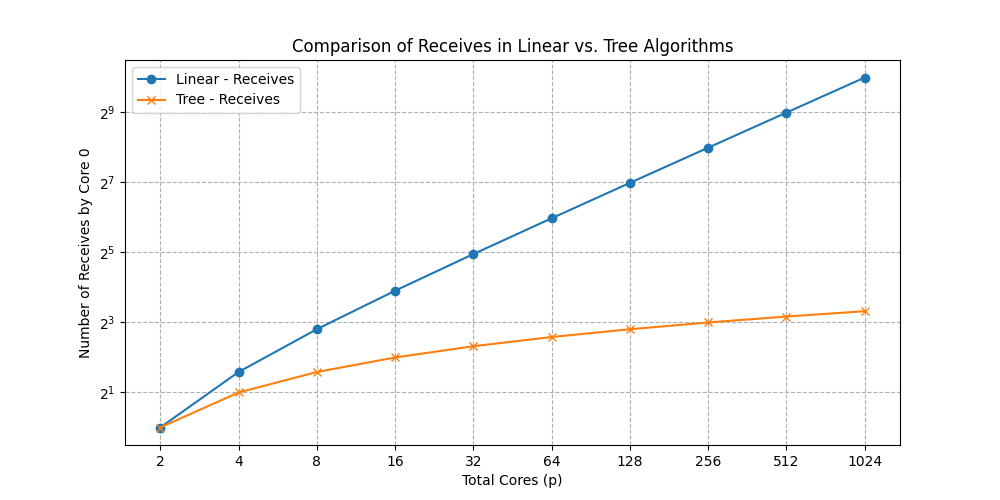

# 并行程序设计与算法第一次作业
March 22, 2024
21307174 刘俊杰
## 1 简答题
### 习题 1
为求全局总和例子中的 my_first_i 和 my_last_i 推导一个公式。需要注意的是：在循环中，应该给各个核分配数目大致相同的计算元素。（提示：先考虑 n 能被 p 整除的情况）。
#### Answer:
设计算元素的下标为 0 到 n-1 , i的下标从 0 开始
##### ① n % p ==0 即 n 能被 p 整除
my_fisrt_i = n/p*(i)
my_last_i = n/p*(i) + n/p
##### ② n % p !=0 即 n 不能被 p 整除
int remain = n % p
if i< remian
then
    my_fisrt_i = n/p*(i+1)
    my_last_i = n/p*(i+1) + n/p + 1
else
    my_first_i = n/p*(i) + remain 
    my_last_i =  n/p*(i) + remain  + n/p


### 习题 2
#### （1）解释局部性原理
#### Answer:

- **时间局部性（Temporal Locality）**：如果一个数据项被访问，那么它在不久的将来很可能再次被访问。这是因为程序往往会在循环中重复使用相同的数据和指令。

- **空间局部性（Spatial Locality）**：如果一个数据项被访问，那么存储在其附近的数据项很快也可能被访问。

#### （2）在以下的代码中，存在何种局部性？
```cpp
float z [ 1 0 0 0 0 ] ;
float sum = 0 . 0 ;
for ( int i = 0; i < 2000; i++)
sum += z [ i ] ;
```
#### Answer:

空间局部性,因**z[i]** 项被访问，那么存储在其附近的数据项 **z[i+1]** 很快也可能被访问。

### 习题 3
#### （1）当 CPU 将数据写入缓存时，缓存中的值可能与主存中的值不一致，有哪两种解决策略？请阐述。
#### Answer:
当CPU将数据写入缓存时，缓存中的值可能与主存中的值不一致，这可能会导致数据一致性问题。为了解决这个问题，有两种主要的解决策略：

1. **写回**：
写回是一种延迟更新策略，即在修改缓存中的数据时，不立即更新主存，而是将其设为脏，等到缓存行被替换出去时才将数据写回主存。
   
2. **写直达**：
写直达是一种立即更新策略，即在修改缓存中的数据时，立即将数据写入到主存中，保持主存和缓存中的数据一致。


#### （2）cache 映射的方式有哪三种？请阐述。
#### Answer:


1. **直接映射**：
在直接映射中，每个主存块只能映射到缓存中的一个固定位置。通过使用主存地址的一部分作为缓存索引来实现映射。因为每个主存块只能映射到一个特定的缓存行，所以可能会发生缓存冲突，即多个主存块映射到同一个缓存行的情况。

2. **组相联**：
在组相联中，主存块可以映射到缓存的多个位置中的一个组。缓存由多个组组成，每个组包含多个缓存行。

3. **全相联**：
在全相联中，任何主存块都可以映射到缓存中的任何位置。这意味着缓存中的每个缓存行都存储一个主存块，并且在查找缓存时需要对整个缓存进行搜索。


### 习题 4
在冯·诺依曼系统中加入缓存和虚拟内存改变了它作为 SISD 系统的类型吗? 如果加入流水线呢? 多发射或硬件多线程呢?
#### Answer:

1. 在冯·诺依曼系统中**加入缓存和虚拟内存**并不会改变它作为**SISD**系统的类型。

2. **加入流水线会改变系统的执行方式**，将其变为**SIMD**系统,因为流水线允许多条指令同时执行。

3. **多发射和硬件多线程**可以使系统变得更加并行，会导致系统变为**MIMD**类型，因为其中多个指令可以同时执行，并且可能针对不同的数据执行不同的指令。
## 2 计算题
### 习题 5
在下列情况中，推导公式求出 0 号核执行接收与加法操作的次数 (假设一共有 p 个核)。


#### a. 在课本 1.3 节的例子中，第一种计算全局总和的算法 (0 号核作为 master 核)。
##### Answer:
(不考虑0核自身对原始数据的加法操作)

接收:p-1 = 7
加法:p-1 = 7
#### b. 在课本 1.3 节的例子中，第二种计算全局总和的算法 (树形结构)。
##### Answer:
(不考虑0核自身对原始数据的加法操作)

接收: `⌈log₂p⌉` = 3
加法: `⌈log₂p⌉` = 3

#### c. 制作一张表来比较这两种算法在总核数是 2、4、8、...、1024 时，0 号核执行的接收与加法操作的次数。
##### Answer:
(不考虑0核自身对原始数据的加法操作)

绘制代码如下:
```python
import matplotlib.pyplot as plt
import numpy as np
import math

# 核心数列表
p_values = [2**i for i in range(1, 11)]

# 计算线性结构算法的操作次数
linear_receives = [p-1 for p in p_values]
linear_adds = [p-1 for p in p_values]

# 计算树形结构算法的操作次数
tree_receives = [math.ceil(math.log2(p)) for p in p_values]  # 使用上确界
tree_adds = [math.ceil(math.log2(p)) for p in p_values]  # 使用上确界

# 绘制接收操作次数比较图
plt.figure(figsize=(10, 5))
plt.plot(p_values, linear_receives, label='Linear - Receives', marker='o')
plt.plot(p_values, tree_receives, label='Tree - Receives', marker='x')
plt.xlabel('Total Cores (p)')
plt.ylabel('Number of Receives by Core 0')
plt.title('Comparison of Receives in Linear vs. Tree Algorithms')
plt.xscale('log', base=2)  # 使用'base'设置对数刻度
plt.yscale('log', base=2)  # 使用'base'修正
plt.xticks(p_values, labels=p_values)
plt.grid(True, which="both", ls="--")
plt.legend()

# 绘制加法操作次数比较图
plt.figure(figsize=(10, 5))
plt.plot(p_values, linear_adds, label='Linear - Adds', marker='o')
plt.plot(p_values, tree_adds, label='Tree - Adds', marker='x')
plt.xlabel('Total Cores (p)')
plt.ylabel('Number of Adds by Core 0')
plt.title('Comparison of Adds in Linear vs. Tree Algorithms')
plt.xscale('log', base=2)  # 一致使用'base'
plt.yscale('log', base=2)  # 这里也正确使用'base'
plt.xticks(p_values, labels=p_values)
plt.grid(True, which="both", ls="--")
plt.legend()

plt.show()

```
绘制图:


### 习题 6
回顾之前一个从缓存读取二维数组的示例 (课本 2.2.3 的实例)。请问一个更大矩阵和一个更大的缓存是如何影响两对嵌套循环的性能的? 如果 MAX =8，缓存可以存储 4 个缓存行，情况又会是怎样的? 在第一对嵌套循环中对 A 的读操作，会导致发生多少次失效? 第二对嵌套循环中的失效次数又是多少?

#### 1. 在第一对嵌套循环中对 A 的读操作，会导致发生多少次失效
##### Answer:
每次循环访问**A[i][0]**  都会未命中，故8次失效
#### 2. 第二对嵌套循环中的失效次数又是多少?
##### Answer:

每次访问都会未命中，故64次失效
