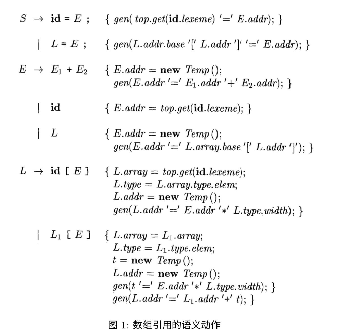

# 2024 编译原理理论 

## 第 2 次作业

本次作业一共有 2 大题, 每道大题都有若干道小题, 部分小题都会给出一个具体的参考例子, 请你确保你的回答和题目提供的例子的样式保持一致, 否则可能会没有分数。

## (1) 数组翻译（5 分）

(a) 已知数组 A 的元素按行优先（Row Major）方式存放在起始于 base 的一片连续单元中，且 A 的类型表达式 (Type Expression) 为 $\operatorname{array}(3, \operatorname{array}(7, \operatorname{array}(8$, float ))), 每个 float 类型的数据占 4 个字节（Byte，则 $\operatorname{address}(\mathrm{A}[\mathrm{i}][\mathrm{j}][\mathrm{k}])=$ base + _______ (将 address 补充完整)。(1 分)

### Answer:

$\operatorname{address}(\mathrm{A}[\mathrm{i}][\mathrm{j}][\mathrm{k}])=$ base + i * 7 * 8 * 4 + j * 8 * 4 + k * 4

= base + 224 i + 32 j + 4 k

(b) 已知维度为 $2 \times 3$ 的二维整型数组 $\mathrm{a}$ 的类型表达式为 $\operatorname{array}(2, \operatorname{array}(3$, integer $))$, 图 1 是数组引用的语义动作，根据该语义动作能够生成 $\mathrm{c}+\mathrm{a}[\mathrm{i}][\mathrm{j}]$ 的注释解析树（Annotated Parse Tree），如图 2(a) 所示，请给出 $\mathrm{c}+\mathrm{A}[\mathrm{i}] \mathrm{j}][\mathrm{k}]$ 的注释解析树（A 的类型请参考第一小题）。(3 分)

### Answer:

(c) 已知每个 int 类型的数据占 4 个字节，根据图 1 的语义动作可以写出 $\mathrm{c}+\mathrm{a}[\mathrm{i}][\mathrm{j}]$ 的三址码，如图 2 (b) 所示，请你写出 $\mathrm{c}+\mathrm{A}[\mathrm{i}][\mathrm{j}][\mathrm{k}]$ 的三址码（A 的类型请参考第一小题）。(1 分)

### Answer:

$$
\begin{aligned}
& \mathrm{t}_{1}=\mathrm{i} * 224 \\
& \mathrm{t}_{2}=\mathrm{j} * 32 \\
& \mathrm{t}_{3}=\mathrm{t}_{1}+\mathrm{t}_{2}\\
& \mathrm{t}_{4}=\mathrm{k} * 4 \\
& \mathrm{t}_{5}=\mathrm{t}_{3}+\mathrm{t}_{4} \\
& \mathrm{t}_{6}=\mathrm{a}\left[\mathrm{t}_{5}\right] \\
& \mathrm{t}_{7}=\mathrm{c}+\mathrm{t}_{6}
\end{aligned}
$$

## (2) 跳转回填（5 分）

(a) 图 3 为布尔表达式的翻译方案，根据该翻译方案可以得到布尔表达式 $x<100 \| x>200 \& \& x!=y$ 的注释语法树, 如图 4(a) 所示, 图中的 $t, f$ 和 $i$ 分别是 truelist, falselist 和 instr 的缩写, 请你给出布尔表达式 $a==b \& \&(c==d \| e==f)$ 的注释语法树。(3 分)

### Answer:

（b）根据图 3 的布尔表达式的翻译方案可以将布尔表达式 $x<100 \| x>200 \& \& x!=y$ 翻译成图 4(b) 的跳转指令, 该翻译过程先将跳转目标留空, 再通过对应的语义动作回填跳转目标, 请你以同样的方式给出 $a==$ $b \& \&(c==d \| e==f)$ 的跳转指令（假设第一条指令的地址为 100）。(2 分)

### Answer:

100:    if a == b goto 102
101:    goto _
102:    if c == d goto _
103:    goto 104
104:    if e == f goto _
105:    goto _

