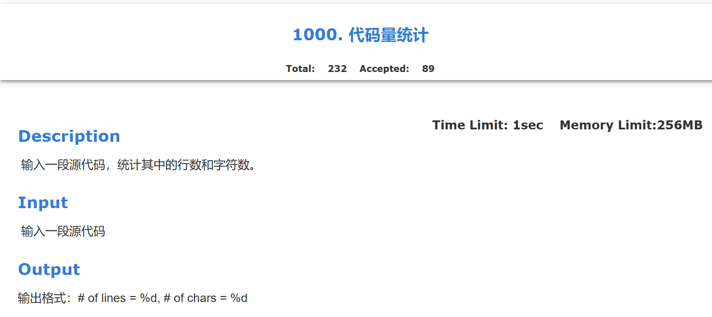
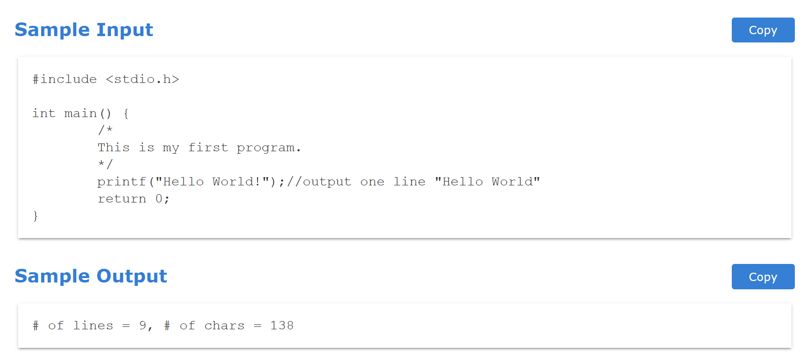
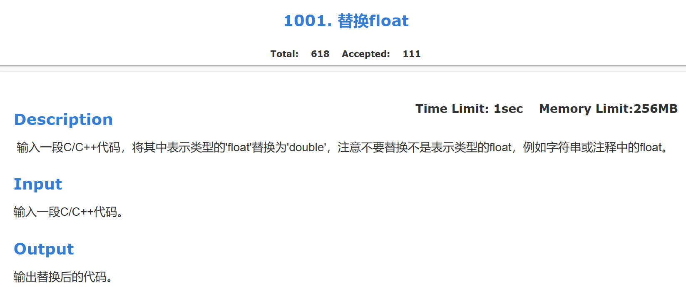
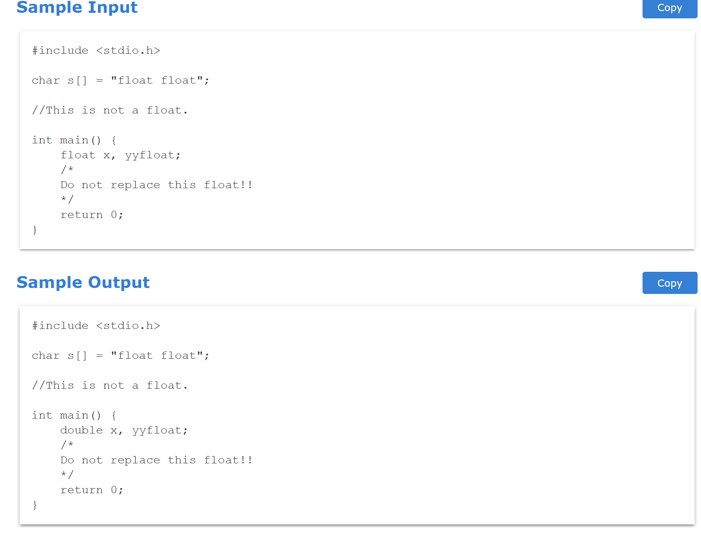
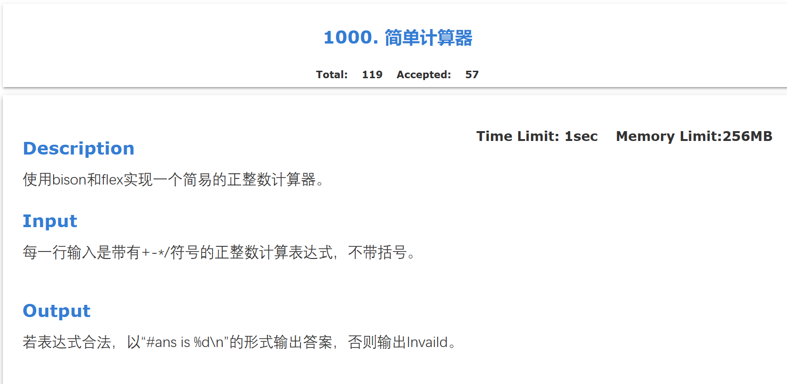
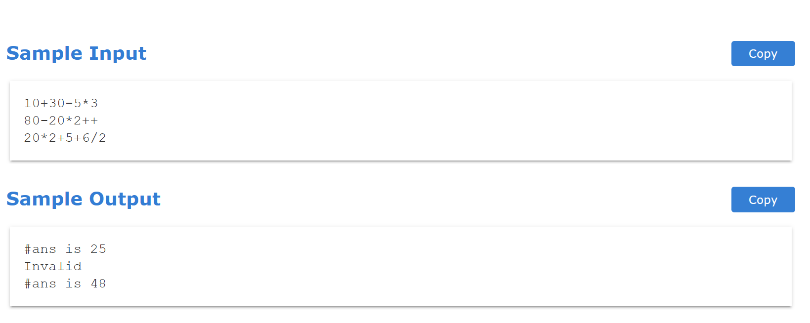
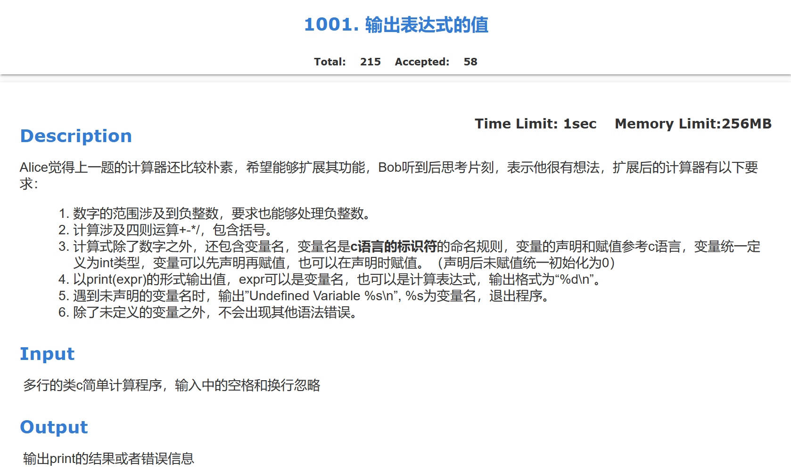
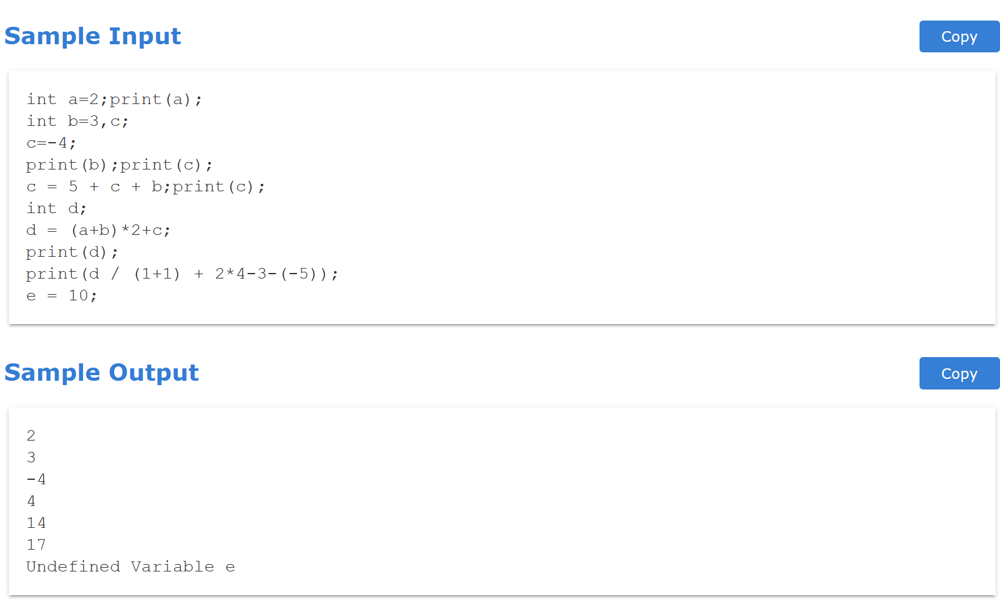

# 编译原理实验week7&week8实验报告
## 1. week7
### 1.1 代码量统计


#### 1.1.1 实验思路
维持 **num_lines** 和 **num_chars** 两个变量分别记录换行数和字符数
- 遇到 **\n** , **num_lines++** 、 **num_char++s**
- 遇到其他字符，**num_char++s**
即:
```c
%option noyywrap
	int num_lines = 0, num_chars = 0;

%%
\n      ++num_lines; ++num_chars;
.       ++num_chars;

%%
```
#### 1.1.2 完整代码实现
```c
%option noyywrap
	int num_lines = 0, num_chars = 0;

%%
\n      ++num_lines; ++num_chars;
.       ++num_chars;

%%
main()
        {
        yylex();
        printf( "# of lines = %d, # of chars = %d\n",
                num_lines, num_chars );
        }
```


####
### 1.2 替换float


#### 1.2.1 实验思路
为了将表示类型的 **float**转换为double(此外的**float**不需要转换)

1. 首先遇到遇到表示类型的**float**，此类以**float**开头且后面接至少一个空格:

 `float[ \t]+   { printf("double "); }`：
   - 这条规则匹配以 "float" 开头，后跟一个或多个空格或制表符的文本。
   - 当匹配到这种模式时，Flex会执行后面的动作，即调用 `printf("double ");` 来输出字符串 "double "。

2.  对其他情况的处理:
`\n | .     { printf("%s", yytext); }`：
   - 这条规则包含两部分，用管道符 `|` 分隔开。
   - 第一部分 `\n` 匹配换行符。
   - 第二部分 `.` 匹配除换行符外的任意单个字符。
   - 当输入的文本匹配到这两部分中的任意一部分时，Flex会执行后面的动作，即调用 `printf("%s", yytext);` 来输出匹配到的文本。

3. 遇到双引号的情况:
   `\"[^\"\n]*\"  { printf("%s", yytext); }`：
   - 这条规则用于匹配双引号括起来的字符串。
   - `\"` 匹配一个双引号，`[^\"\n]*` 匹配除了双引号和换行符之外的任意字符，直到下一个双引号。
   - 当匹配到这种模式时，Flex会执行后面的动作，即调用 `printf("%s", yytext);` 来输出匹配到的字符串。

即:
```c
float[ \t]+   { printf("double "); }
\n | .     { printf("%s", yytext); }
\"[^\"\n]*\"  { printf("%s", yytext); }
```


#### 1.2.2 完整代码实现
```c
%option noyywrap

%%

float[ \t]+   { printf("double "); }
\n | .     { printf("%s", yytext); }
\"[^\"\n]*\"  { printf("%s", yytext); }

%%

int main() {
    yylex();
    return 0;
}

```

## 2. week8
### 2.1 简单计算器


#### 2.1.1 代码实现(此题代码助教已给出)
#####  2.1.1.1 lex.l
```c
/*lex.l*/
%{
#include <stdio.h>
#include "parser.tab.h"
void yyerror(char *);
%}
%option noyywrap
NUM [1-9]+[0-9]*|0 
%%
{NUM}   {yylval.inum=atoi(yytext);return NUM;}
"+"     return ADD;
"-"     return SUB;
"*"     return MUL;
"/"     return DIV;
\n      return NEWLINE;
[ \t]+      /* ignore whitespace */;
.
%%
```
##### 2.1.1.2 parser.y
```c
/*parser.y*/
%{
#include <stdio.h>
int yylex(void);
void yyerror(char *);
%}

%union{
  int inum;
  double dnum;
}

%token ADD SUB MUL DIV NEWLINE
%token <inum> NUM
%type <inum> expression term single
%%
        line_list: line
                | line_list line;
        line : expression NEWLINE {printf("#ans is %d\n",$1);}
                | error NEWLINE { yyerrok;}
        expression: term
                | expression ADD term { $$ = $1 + $3; }
                | expression SUB term { $$ = $1 - $3; };
        term: single
                | term MUL single { $$ = $1 * $3; }
                | term DIV single { $$ = $1 / $3; };
        single: NUM;
%%
void yyerror(char * str){
    printf("Invalid\n");
}

int main()
{
    yyparse();
}
```
#### 2.1.2 代码详解
##### 2.1.2.1 `lex.l` ：

```c
%{
#include <stdio.h>
#include "parser.tab.h"
void yyerror(char *);
%}
%option noyywrap
NUM [1-9]+[0-9]*|0 
%%
{NUM}   {yylval.inum=atoi(yytext);return NUM;}
"+"     return ADD;
"-"     return SUB;
"*"     return MUL;
"/"     return DIV;
\n      return NEWLINE;
[ \t]+      /* ignore whitespace */;
.
%%
```

- `%option noyywrap` 告诉 Flex 不要自动生成 `yywrap` 函数。
- `NUM` 是一个正则表达式，用于匹配数字。
```c
{NUM}   {yylval.inum=atoi(yytext);return NUM;}
```
- 当匹配到一个数字时，会执行 `{yylval.inum=atoi(yytext);return NUM;}`，将数字的值保存到 `yylval` 中并返回 `NUM` 标记。
```c
"+"     return ADD;
"-"     return SUB;
"*"     return MUL;
"/"     return DIV;
\n      return NEWLINE;
[ \t]+      /* ignore whitespace */;
```
- 用于匹配加减乘除运算符和换行符等，每个规则都返回相应的标记。

##### 2.1.2.2 `parser.y` ：
```c
%union{
  int inum;
  double dnum;
}

%token ADD SUB MUL DIV NEWLINE
%token <inum> NUM
%type <inum> expression term single
```
- `%union` 声明了联合体，用于在解析器中传递终结符的值。
- `%token` 声明了终结符的标记，包括加减乘除运算符和换行符等。
- `%type` 声明了非终结符的类型。
- `line_list` 和 `line` 规则定义了语法规则，用于解析一行表达式。
```c
expression: term
                | expression ADD term { $$ = $1 + $3; }
                | expression SUB term { $$ = $1 - $3; };
        term: single
                | term MUL single { $$ = $1 * $3; }
                | term DIV single { $$ = $1 / $3; };
        single: NUM;
```

- 定义了表达式的语法结构，加减乘除运算和返回数字值。
```c
void yyerror(char * str){
    printf("Invalid\n");
}
```

- `yyerror` 函数用于在解析错误时输出错误信息。


### 2.2 输出表达式


#### 2.2.1 实验思路
1. 变量的存储,由于变量的个数不确定,使用动态数组即链表的结构来存储变量,同时需要构建一个变量的结构体来记录变量名、变量是否被赋值、变量的值:
```c
typedef struct Variables{
    char* var; //变量名
    int value; // 变量值
    int is_assigned; //是否被赋值
    struct Variables* next; //下一个变量
}Variables;
```

2. 对变量的操作:
定义一个全局变量head，方便访问变量链表:
```c
Variables *head = NULL;
```
对指定表达量名在变量链表中进行查询
```c
Variables* Variables_find(const char*var_name){
    Variables* temp = head;
    while(temp){
        if(!strcmp(temp->var, var_name)){
            return temp;
        }
        temp = temp->next;
    }
    return NULL;
}
```
增加变量或修改变量值
```c
void Variables_add(const char*var_name, int value,int is_assigned){
    Variables*new_var = (Variables*)malloc(sizeof(Variables));
    new_var->value = value;
    new_var->var = (char*)malloc(strlen(var_name)+1);
    new_var->is_assigned = is_assigned;
    strcpy(new_var->var,var_name);
    new_var->next = head;
    head = new_var;
    
}
```
释放变量链表中的空间
```c
void Variables_free(){
    Variables* temp =  head;
    while(temp){
        Variables*temp_next = temp->next;
        free(temp->var);
        free(temp);
        temp = temp_next;
    }
    head = NULL;
}
```

3. lex2.l中的NUM和VAR的正则表达式 及 规则标记
```c
%option noyywrap
NUM [1-9]+[0-9]*|0
VAR [a-zA-Z_][a-zA-Z0-9_]*

%%
{NUM}   {yylval.inum=atoi(yytext);return NUM;}
"print" return PRINT; 
"int"   return INT; 
{VAR}   {yylval.name=strdup(yytext); return VAR;}
"("     return L_BRACKET;
")"     return R_BRACKET;
"="     return ASSIGN;
";"     return SEMICOLON;
","     return COMMA;
"+"     return ADD;
"-"     return SUB;
"*"     return MUL;
"/"     return DIV;
\n      return NEWLINE;
[ \t]+      /* ignore whitespace */;
.
%%
```
4. 语法规则
```c
code: 
            | code line;
```
这一规则主要是将代码分行来分析推导 line是一行的代码包括换行符
```c
        line :   codes_in_line NEWLINE;
```
将一行代码分为代码部分和换行符
```c
        codes_in_line: code_in_line
            |codes_in_line code_in_line ;
```
将一行代码分为多部份代码,如: int a;int b;(在同一行)
这一语法可将上述例子中int a;和int b;分开分析 
```c
        code_in_line :SEMICOLON
                | definition SEMICOLON 
                
                | PRINT L_BRACKET expression R_BRACKET SEMICOLON{
                    printf("%d\n",$3);
                }
                | var_assign SEMICOLON;
```
- SEMICOLON: ; (但其实不必要,因为该语法对下面几种情况加了SEMICOLON;若未添加,则该部分不能少)
- definition SEMICOLON: 如: int a = 1; 
- PRINT L_BRACKET expression R_BRACKET SEMICOLON:遇到打印变量值,先调用Variables_find()查询是否有定义过该变量,如果没有则报错;否之打印出其值 如: print(a) 
- var_assign SEMICOLON : 如: a = b;

```c             
        var_assign: VAR ASSIGN expression {
            Variables*temp = Variables_find($1);
            if(!temp){
                char msg[256];
                sprintf(msg, "%s", $1);
                yyerror(msg);
            }
            else {
                temp->value = $3;
                temp->is_assigned = 1;
            }
        }  
        | VAR ASSIGN expression COMMA var_assign;
```
变量赋值语法:
- VAR ASSIGN expression:如: a = 1 + 2 
首先调用Variables_find查找之前是否定义过a,如果没有则报错，否则给其变量赋值 
- VAR ASSIGN expression COMMA var_assign: 如: a = 1,b = 2

```c
        definition: INT VAR ASSIGN expression  {Variables_add($2,$4,1);}
                | INT VAR  {Variables_add($2,0,0);}
                | definition COMMA VAR  {Variables_add($3,0,0);}
                | definition COMMA VAR ASSIGN expression  {Variables_add($3,$5,1);};
```
定义变量语法规则: 调用Variables_add()增加定义变量并对其赋值(如果赋值了)
- INT VAR ASSIGN expression: 如: int a = 1 + 2;
- INT VAR: 如: int a;
- definition COMMA VAR: 如: int a = 1, b;
- definition COMMA VAR ASSIGN expression : 如: int a = 1 + 2, b = 2;
```c
        expression: term
                | expression ADD term { $$ = $1 + $3; }
                | expression SUB term { $$ = $1 - $3; };
```
加减法语法规则
```c
        term: single
                | term MUL single { $$ = $1 * $3; }
                | term DIV single { $$ = $1 / $3; };
```
乘除法语法规则
```c
        single: NUM
                | L_BRACKET expression R_BRACKET{$$ = $2;}
                | SUB NUM {$$ = -$2;}
                | VAR {
                    Variables *find = Variables_find($1);
                    if(!find){
                        
                        char msg[256];
                        sprintf(msg, "%s", $1);
                        yyerror(msg);
                    }
                    else {
                        $$ = find->value;
                    }
                };
```
- NUM:直接返回值
- SUB NUM:取反操作
- L_BRACKET expression R_BRACKET: 带有括号,直接返回值
- VAR :调用Variables_find()查询该变量是否存在,不存在则报错，存在则返回变量值
#### 2.2.2 完整代码实现
##### 2.2.2.1 lex2.l
```c
/*lex2.l*/
%{
#include <stdio.h>
#include "parser2.tab.h"
void yyerror(char *);
%}

%option noyywrap
NUM [1-9]+[0-9]*|0
VAR [a-zA-Z_][a-zA-Z0-9_]*

%%
{NUM}   {yylval.inum=atoi(yytext);return NUM;}
"print" return PRINT; 
"int"   return INT; 
{VAR}   {yylval.name=strdup(yytext); return VAR;}
"("     return L_BRACKET;
")"     return R_BRACKET;
"="     return ASSIGN;
";"     return SEMICOLON;
","     return COMMA;
"+"     return ADD;
"-"     return SUB;
"*"     return MUL;
"/"     return DIV;
\n      return NEWLINE;
[ \t]+      /* ignore whitespace */;
.
%%
```
#####  2.2.2.2 parser2.h
```c
/*parser2.y*/
%{
#include <stdio.h>
#include <string.h>
#include <stdlib.h>

int yylex(void);
void yyerror(char *str);

typedef struct Variables{
    char* var;
    int value;
    int is_assigned;
    struct Variables* next;
}Variables;

Variables *head = NULL;

Variables* Variables_find(const char*var_name);
void Variables_add(const char*var_name, int value,int is_assigned);
void Variables_free();

%}

%union{
  int inum;
  double dnum;
  char* name;
}

%token ADD SUB MUL DIV NEWLINE SEMICOLON ASSIGN COMMA PRINT INT R_BRACKET L_BRACKET
%token <inum> NUM
%token <name> VAR
%type <inum> expression term single
%%
        code: 
            | code line;

        line :   codes_in_line NEWLINE;

        codes_in_line: code_in_line
            |codes_in_line code_in_line ;

        code_in_line :SEMICOLON
                | definition SEMICOLON 
                
                | PRINT L_BRACKET expression R_BRACKET SEMICOLON{
                    printf("%d\n",$3);
                }
                | var_assign SEMICOLON;
                


        var_assign: VAR ASSIGN expression {
            Variables*temp = Variables_find($1);
            if(!temp){
                char msg[256];
                sprintf(msg, "%s", $1);
                yyerror(msg);
            }
            else {
                temp->value = $3;
                temp->is_assigned = 1;
            }
        }  
        | VAR ASSIGN expression COMMA var_assign;

        definition: INT VAR ASSIGN expression  {Variables_add($2,$4,1);}
                | INT VAR  {Variables_add($2,0,0);}
                | definition COMMA VAR  {Variables_add($3,0,0);}
                | definition COMMA VAR ASSIGN expression  {Variables_add($3,$5,1);};

        expression: term
                | expression ADD term { $$ = $1 + $3; }
                | expression SUB term { $$ = $1 - $3; };

        term: single
                | term MUL single { $$ = $1 * $3; }
                | term DIV single { $$ = $1 / $3; };

        single: NUM
                | L_BRACKET expression R_BRACKET{$$ = $2;}
                | SUB NUM {$$ = -$2;}
                | VAR {
                    Variables *find = Variables_find($1);
                    if(!find){
                        
                        char msg[256];
                        sprintf(msg, "%s", $1);
                        yyerror(msg);
                    }
                    else {
                        $$ = find->value;
                    }
                };
                

                
%%
void yyerror(char * str){
    
    printf("Undefined Variable %s\n",str);
    exit(EXIT_FAILURE);
}

Variables* Variables_find(const char*var_name){
    Variables* temp = head;
    while(temp){
        if(!strcmp(temp->var, var_name)){
            return temp;
        }
        temp = temp->next;
    }
    return NULL;
}

void Variables_add(const char*var_name, int value,int is_assigned){
    Variables*new_var = (Variables*)malloc(sizeof(Variables));
    new_var->value = value;
    new_var->var = (char*)malloc(strlen(var_name)+1);
    new_var->is_assigned = is_assigned;
    strcpy(new_var->var,var_name);
    new_var->next = head;
    head = new_var;
    
}

void Variables_free(){
    Variables* temp =  head;
    while(temp){
        Variables*temp_next = temp->next;
        free(temp->var);
        free(temp);
        temp = temp_next;
    }
    head = NULL;
}

int main()
{
    yyparse();
    Variables_free();
}

```
## 3. 本次实验遇到的问题及感悟
### 3.2 实验感悟
通过本次实验,我学会了使用Bison和Flex进行词法分析和语法分析