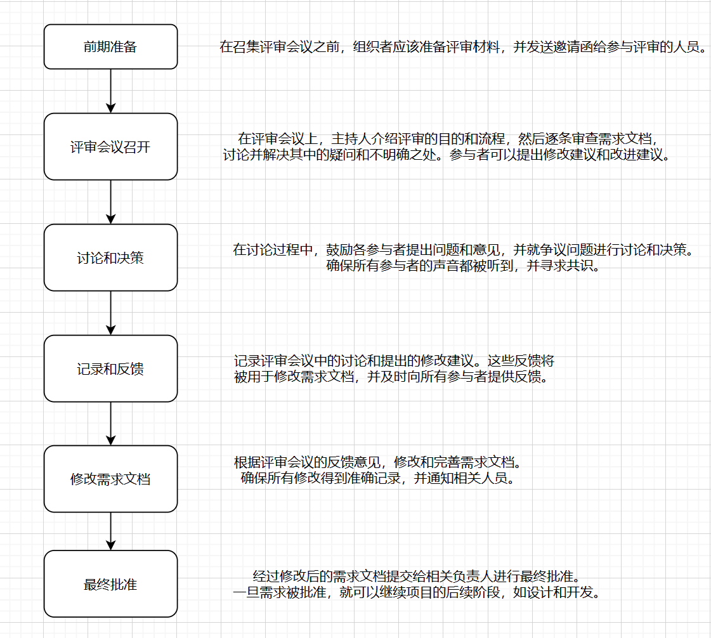

# 中山大学软件工程第一次作业

学号|21307174|姓名|刘俊杰
-|-|-|-
**专业**|**计算机科学与技术**|**Email**|**liujj255@mail2.sysu.edu.cn**|

## 4.4 为售票系统书写一组非功能性需求，明确所期望的可靠性和响应时间。
### Answer:

#### 可靠性要求：
1. **系统可用性：** 系统应当保证24/7的全天候可用性，即使在高负载时期或网络故障的情况下，用户也能够访问系统。例如，系统应该能够处理每秒数百个请求，即使是在高峰时段也不会出现系统崩溃的情况。
   
2. **数据一致性：** 系统应确保所有交易过程中的数据一致性，包括座位的实时更新和支付事务的成功确认。例如，在用户预订座位后，系统应立即将座位状态从可用更改为已预订，并在用户完成支付后将其更新为已售出。

3. **容错性：** 系统应该能够容忍硬件故障、软件错误或其他异常情况，并且能够在出现问题时恢复正常运行，不会影响用户体验。例如，如果系统的某个服务器发生故障，应该能够自动将流量转移到其他可用服务器，并且不会中断用户的购票流程。

#### 响应时间要求：
1. **页面加载时间：** 所有页面的加载时间应该尽可能短，以确保用户在浏览座位选择和完成购票流程时的流畅体验。例如，网页应在3秒内加载完成，以确保用户不会因等待过长而放弃购票。

2. **交易处理时间：** 系统应当在用户提交订单后尽快进行订单处理，以确保交易能够及时完成，避免用户等待过长。例如，系统应在用户点击购买按钮后的1秒内响应，快速处理订单并向用户发送确认邮件。

3. **实时更新：** 座位的实时更新应该立即反映在用户界面上，以避免多人同时预订同一座位的情况发生。例如，当有用户预订座位时，系统应立即将该座位标记为已预订，并在其他用户尝试预订同一座位时显示为不可用。

## 4.5 使用本章所建议的技术(其中自然语言描述呈现为标准的格式)，针对下面这些功能书写看似合理的用户需求。
- 一个无人值守的汽油泵系统，包含一个信用卡读卡器。客户通过读卡器刷卡，然后输人所需要的汽油量。系统供应相应数量的汽油，并从客户的账户扣款
- 一个银行 ATM 机的现金取款功能。
- 在一个互联网银行系统中，允许客户从所持有的当前银行的一个账户中转账到同一
银行的另一个账户的功能，

### Answer:

#### 无人值守汽油泵系统

用户通过信用卡读卡器刷卡，并输入所需汽油量。当用户刷卡并输入汽油量后，系统必须将自动供应相应数量的汽油，并从客户的账户扣款。

#### 银行ATM机的现金取款功能
用户可以在银行ATM机上进行现金取款操作。 用户应该可以在ATM机上选择取款选项，并输入所需取款金额。系统必须会验证用户的账户信息，并在取款金额不超过账户余额的情况下，将相应金额的现金提供给用户。

#### 互联网银行系统中的账户转账功能

用户可以从持有的当前银行账户向同一银行的另一个账户进行转账。用户可以登录到互联网银行系统，选择转账选项，并输入转账金额以及目标账户信息。系统将验证用户的身份和账户信息，并在转账金额不超过账户余额的情况下，执行转账操作，并即时更新账户余额和交易记录。

## 4.8 哪些人应该参加需求评审?画一个过程模型，描述需求评审如何组织。

### Answer:

### 参与人员：

1. **用户代表：** 最终用户或业务代表，能够提供关于业务流程和实际需求的重要见解。
2. **设计师/UX专家：** 可以确保用户界面和交互设计符合用户体验的最佳实践，并提供设计上的建议。
3. **质量保证团队：** 包括质量分析师和测试人员，可以确保需求的可测试性，并提供关于需求可行性和测试策略的反馈。
4. **安全专家：** 可以评估需求对系统安全性和数据隐私的影响，并提供安全方面的建议。
5. **运维团队：** 可以评估需求对系统运维和部署的影响，并提供运维方面的反馈和建议。
6. **法律和合规专家：** 如果项目涉及法律和合规问题，应该邀请法律和合规专家参与评审，以确保需求符合相关法律法规。

### 过程模型组织：

