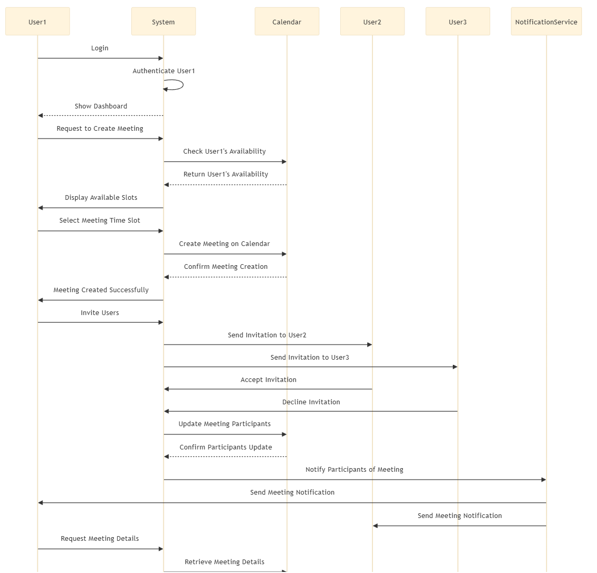

# 软件工程第四次作业
### 21307174 刘俊杰
## 7.3
使用UML对于对象类的表示法设计下列对象类，识别属性和操作。根据你自己的经验来决定与这些对象相关联的属性和操作。
### 一个移动电话或者平板电脑上的消息通信系统；
 Class: MessageSystem                   ||
|----------------------------------------|------------------------------------|
| **Attributes:**                        ||
| - userId: int                          | Identifies the user of the system  |
| - contacts: List\<Contact\>            | List of contacts                   |
| - messages: List\<Message\>            | List of messages                   |
| **Operations:**                        ||
| + sendMessage(receiverId: int, content: String): void | Send a message to a contact      |
| + receiveMessage(senderId: int, content: String): void | Receive a message from a contact |
| + addContact(contact: Contact): void   | Add a new contact                  |
| + removeContact(contactId: int): void | Remove a contact by ID             |
| + getMessages(contactId: int): List\<Message\> | Get messages from a contact   |

| Class: Contact                        ||
|---------------------------------------|------------------------------------|
| **Attributes:**                       ||
| - contactId: int                       | Unique identifier for the contact  |
| - name: String                         | Name of the contact                |
| - phoneNumber: String                  | Phone number of the contact        |

| Class: Message                        ||
|---------------------------------------|------------------------------------|
| **Attributes:**                       ||
| - messageId: int                       | Unique identifier for the message  |
| - senderId: int                        | ID of the sender                   |
| - receiverId: int                      | ID of the receiver                 |
| - timestamp: DateTime                  | Timestamp when the message was sent|
| - content: String                      | Content of the message             |

### 一个个人计算机的打印机；
| Class: Printer                        ||
|---------------------------------------|------------------------------------|
| **Attributes:**                       ||
| - printerId: int                       | Unique identifier for the printer  |
| - status: String                       | Current status of the printer     |
| - printQueue: Queue\<Document\>        | Queue of documents to be printed  |
| **Operations:**                       ||
| + print(document: Document): void     | Print a document                   |
| + cancelPrint(documentId: int): void  | Cancel printing of a document      |
| + getStatus(): String                 | Get the current status of the printer |
| + addToQueue(document: Document): void| Add a document to the print queue  |
| + removeFromQueue(documentId: int): void | Remove a document from the print queue |

| Class: Document                       ||
|---------------------------------------|------------------------------------|
| **Attributes:**                       ||
| - documentId: int                      | Unique identifier for the document |
| - title: String                        | Title of the document              |
| - content: String                      | Content of the document           |
| - ownerId: int                         | ID of the document owner          |

### 一个个人音乐系统；
| Class: MusicSystem                    ||
|---------------------------------------|------------------------------------|
| **Attributes:**                       ||
| - systemId: int                        | Unique identifier for the system   |
| - playlists: List\<Playlist\>          | List of playlists in the system    |
| - currentSong: Song                    | Currently playing song             |
| - volumeLevel: int                     | Current volume level               |
| **Operations:**                       ||
| + play(song: Song): void               | Start playing a song               |
| + pause(): void                        | Pause the currently playing song   |
| + stop(): void                         | Stop playing the current song      |
| + nextSong(): void                     | Play the next song in the playlist |
| + previousSong(): void                 | Play the previous song in the playlist |
| + adjustVolume(level: int): void       | Adjust the volume level            |
| + createPlaylist(name: String): void   | Create a new playlist             |
| + deletePlaylist(playlistId: int): void| Delete a playlist by ID            |

| Class: Playlist                       ||
|---------------------------------------|------------------------------------|
| **Attributes:**                       ||
| - playlistId: int                      | Unique identifier for the playlist |
| - name: String                         | Name of the playlist              |
| - songs: List\<Song\>                  | List of songs in the playlist      |

| Class: Song                           ||
|---------------------------------------|------------------------------------|
| **Attributes:**                       ||
| - songId: int                          | Unique identifier for the song     |
| - title: String                        | Title of the song                  |
| - artist: String                       | Artist of the song                 |
| - album: String                        | Album of the song                  |
| - duration: int                        | Duration of the song (in seconds)  |
### 一个银行账户；
| Class: BankAccount                    ||
|---------------------------------------|------------------------------------|
| **Attributes:**                       ||
| - accountId: int                       | Unique identifier for the account  |
| - accountHolder: String                | Name of the account holder         |
| - balance: double                      | Current balance of the account     |
| - transactions: List\<Transaction\>    | List of transactions on the account |
| **Operations:**                       ||
| + deposit(amount: double): void        | Deposit money into the account     |
| + withdraw(amount: double): void       | Withdraw money from the account    |
| + getBalance(): double                 | Get the current balance of the account |
| + getTransactions(): List\<Transaction\> | Get the list of transactions   |

| Class: Transaction                    ||
|---------------------------------------|------------------------------------|
| **Attributes:**                       ||
| - transactionId: int                   | Unique identifier for the transaction |
| - type: String                         | Type of the transaction (e.g., deposit, withdrawal) |
| - amount: double                       | Amount of money involved in the transaction |
| - date: DateTime                       | Date and time of the transaction   |
| - description: String                  | Description of the transaction     |
### 一个图书馆目录。
| Class: LibraryCatalog                 ||
|---------------------------------------|------------------------------------|
| **Attributes:**                       ||
| - catalogId: int                       | Unique identifier for the catalog  |
| - books: List\<Book\>                  | List of books in the catalog       |
| - members: List\<Member\>              | List of members in the library     |
| **Operations:**                       ||
| + addBook(book: Book): void            | Add a new book to the catalog      |
| + removeBook(bookId: int): void        | Remove a book from the catalog by ID |
| + findBook(title: String): List\<Book\> | Find books by title               |
| + checkoutBook(bookId: int, memberId: int): void | Check out a book     |
| + returnBook(bookId: int, memberId: int): void | Return a book             |

| Class: Book                           ||
|---------------------------------------|------------------------------------|
| **Attributes:**                       ||
| - bookId: int                          | Unique identifier for the book     |
| - title: String                        | Title of the book                  |
| - author: String                       | Author of the book                 |
| - isbn: String                         | ISBN of the book                   |
| - isCheckedOut: boolean                | Indicates if the book is checked out |

| Class: Member                         ||
|---------------------------------------|------------------------------------|
| **Attributes:**                       ||
| - memberId: int                        | Unique identifier for the member   |
| - name: String                         | Name of the member                 |
| - checkedOutBooks: List\<Book\>        | List of books checked out by the member |


## 7.5
开发一个气象站的设计来展示数据收集子系统和收集气象数据的仪器之间的交互。使用顺序图来展示这些交互。


## 7.6

识别下列系统中可能的对象并为它们开发一个面向对象的设计。在考虑设计时，你可以做出关于这些系统的任何合理假设。

### 一个小组日程和时间管理系统，希望能够支持对一组同事之间的会议和预约进行时间安排。当做出包含多人的预约时，系统要找出他们的日程中一个共同的时间段并且将预约安排到这个时间段上。如果找不到共同的时间段，系统与用户进行交互以重新安排他的个人日程，从而使预约可以找到合适的时间。

对象：

1. **User（用户）**
   - Attributes: userId, username, schedule
   - Operations: addEvent, removeEvent, rescheduleEvent

2. **Event（事件）**
   - Attributes: eventId, title, startTime, endTime, attendees
   - Operations: addAttendee, removeAttendee, checkConflicts, findCommonTime

3. **Calendar（日程表）**
   - Attributes: events
   - Operations: addEvent, removeEvent, getEventsBetween

4. **Scheduler（调度器）**
   - Operations: findCommonTime, suggestReschedule

### UML 类图设计

```plaintext
+-----------------------+
|         User          |
+-----------------------+
| - userId: int         |
| - username: String    |
| - schedule: Calendar  |
+-----------------------+
| + addEvent(event: Event): void |
| + removeEvent(eventId: int): void |
| + rescheduleEvent(eventId: int, newStartTime: DateTime): void |
+-----------------------+

+-----------------------+
|        Event          |
+-----------------------+
| - eventId: int        |
| - title: String       |
| - startTime: DateTime |
| - endTime: DateTime   |
| - attendees: List<User> |
+-----------------------+
| + addAttendee(user: User): void |
| + removeAttendee(userId: int): void |
| + checkConflicts(event: Event): boolean |
| + findCommonTime(): DateTime |
+-----------------------+

+-----------------------+
|       Calendar        |
+-----------------------+
| - events: List<Event> |
+-----------------------+
| + addEvent(event: Event): void |
| + removeEvent(eventId: int): void |
| + getEventsBetween(startDate: DateTime, endDate: DateTime): List<Event> |
+-----------------------+

+-----------------------+
|      Scheduler        |
+-----------------------+
| + findCommonTime(users: List<User>, duration: int): DateTime |
| + suggestReschedule(event: Event): void |
+-----------------------+
```


- **User** 类代表系统中的用户，每个用户有自己的日程表（Calendar），可以添加、删除和重新安排事件。
- **Event** 类表示会议或预约，包括开始时间、结束时间和参与者列表。它可以检查时间冲突并找到参与者的共同空闲时间。
- **Calendar** 类维护用户的所有事件列表，支持添加、删除和查询特定时间段内的事件。
- **Scheduler** 类负责调度系统，可以找到多个用户的共同空闲时间或建议重新安排事件。

### 一个完全自动化运营的加油站即将开业。驾驶员通过一个与油泵相连的读卡器刷他的信用卡:所刷的卡通过与一个信用卡公司的计算机通信进行验证，并建立一个燃料限量。接着驾驶员就可以获得所需要的燃料了。当燃料供应完成后，油泵软管回归皮套。信用卡在扣费后返回卡。如果信用卡不合法，那么油泵在加油之前就会返回卡。

对象：

1. **FuelPump（油泵）**
   - Attributes: pumpId, isBusy, creditCardReader
   - Operations: startFueling, stopFueling

2. **CreditCardReader（信用卡读卡器）**
   - Attributes: isConnected, isCardValid, creditLimit
   - Operations: connect, validateCard, chargeCard, disconnect

3. **CreditCard（信用卡）**
   - Attributes: cardNumber, expirationDate, ownerName, balance
   - Operations: authorize, charge, returnCard

### UML 类图设计

```plaintext
+-----------------------+
|      FuelPump         |
+-----------------------+
| - pumpId: int         |
| - isBusy: boolean     |
| - creditCardReader: CreditCardReader |
+-----------------------+
| + startFueling(creditCard: CreditCard): void |
| + stopFueling(): void |
+-----------------------+

+-----------------------+
|   CreditCardReader    |
+-----------------------+
| - isConnected: boolean|
| - isCardValid: boolean|
| - creditLimit: double |
+-----------------------+
| + connect(): void     |
| + validateCard(creditCard: CreditCard): boolean |
| + chargeCard(creditCard: CreditCard, amount: double): boolean |
| + disconnect(): void  |
+-----------------------+

+-----------------------+
|     CreditCard        |
+-----------------------+
| - cardNumber: String  |
| - expirationDate: String |
| - ownerName: String   |
| - balance: double     |
+-----------------------+
| + authorize(): boolean |
| + charge(amount: double): boolean |
| + returnCard(): void  |
+-----------------------+
```


- **FuelPump** 类代表加油站的油泵，每个油泵都有一个信用卡读卡器，可以处理信用卡的连接、验证和扣款操作。
- **CreditCardReader** 类处理信用卡的连接状态、验证卡片有效性和扣款操作。
- **CreditCard** 类代表信用卡，可以授权、扣款和返回卡片。


## 7.7 画一个顺序图展示小组日程系统在一组人正在安排一个会议时对象间的交互。




1. **用户登录**: 用户1登录系统。

2. **身份验证**: 系统验证用户1的身份。

3. **创建会议**: 用户1请求创建会议，系统检查可用性并在日历上创建会议。

4. **发送邀请**: 用户1通过系统发送会议邀请给用户2和用户3。

5. **邀请响应**: 用户2接受邀请，用户3拒绝邀请。

6. **更新参与者**: 系统更新会议参与者信息。

7. **发送通知**: 系统通过通知服务向参与者发送会议通知。

8. **获取会议详情**: 用户1请求会议详情，系统从日历获取并展示详情。

9. **重排会议**: 用户2请求重新安排会议，系统检查新的可用性并更新会议时间。

10. **发送重排通知**: 系统通过通知服务发送会议时间更改通知。

11. **开始会议**: 用户1开始会议，系统在日历上标记会议状态。

12. **用户加入**: 用户2加入会议，系统更新会议状态。

13. **结束会议**: 用户1结束会议，系统在日历上标记会议状态并通过通知服务发送结束通知。


## 7.8 画一个UML状态图来展示小组日程系统或者加油系统可能的状态变化。
小组日程系统:
