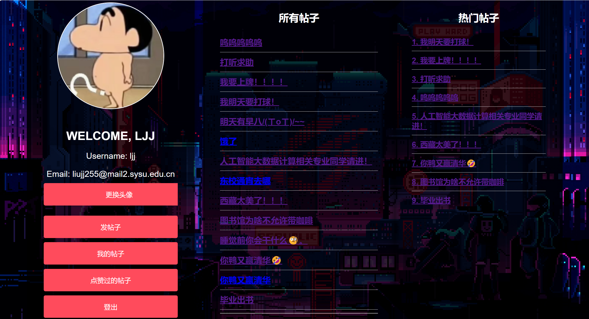

# 软件工程课程设计功能描述文档
## 一、课程设计介绍
课程设计的校园论坛平台提供了用户注册与登录、个人信息管理、帖子发布与管理、互动浏览、以及管理员管理等功能:
- 用户可以注册并登录平台，修改头像，发布和管理自己的帖子，浏览和评论所有帖子，点赞或取消点赞，并查看自己点赞的帖子。
- 平台首页有热帖排行榜，展示当前最受欢迎的帖子。
- 管理员能够浏览和删除所有帖子，维护论坛秩序，确保内容健康。

具体功能点如下:

- **用户注册**：用户可以通过用户名注册账号，填写必要的个人信息。

- **不规范注册提示**：对邮箱格式不对、用户名被占用等情况对用户做出提示。

- **用户登录平台**：注册用户可以使用手机号/邮箱和密码登录平台，访问各项功能。

- **对不正确的登录用户名和密码提示**：对不正确的登录用户名和密码提示。

- **用户退出登录**：用户可以随时退出登录，保障账号安全，防止未授权的访问。

- **修改头像**：用户可以上传和修改自己的头像，展示个性化形象，使个人资料更加完整。

- **查看自己的帖子**：用户可以查看自己发布的帖子。

- **删除自己的帖子**：用户可以删除自己发布的帖子，管理自己的内容。

- **发布帖子**：用户可以在论坛上发布帖子，分享信息、讨论话题，内容包括文字、图片等。

- **浏览所有帖子**：用户可以浏览平台上所有的帖子，找到感兴趣的内容，点击图片可查看帖子图片。

- **评论帖子**：用户可以在帖子下面发表评论，与其他用户进行互动交流，发表自己的观点和看法。

- **点赞帖子**：用户可以点赞自己喜欢的帖子，表达支持和认可，提高帖子在热帖排行榜中的排名。

- **取消点赞**：用户可以取消之前的点赞，调整自己的点赞记录。

- **查看自己点赞的帖子**：用户可以查看自己点赞过的所有帖子，方便回顾和管理点赞记录。

- **平台首页展示热帖排行榜**：首页展示当前平台上的热门帖子，根据点赞数排序，吸引用户关注。

- **管理员浏览所有帖子**：管理员可以查看平台上所有的帖子，了解用户的发帖情况，进行审核和管理。

- **管理员删除帖子**：管理员可以删除帖子，维护论坛秩序，确保内容健康，防止违规信息传播。

## 二、课程设计功能说明

### 校园论坛平台功能说明

校园论坛平台提供了用户注册与登录、个人信息管理、帖子发布与管理、互动浏览、以及管理员管理等功能。具体功能点如下：

- **用户注册**：用户可以通过用户名注册账号，填写必要的个人信息:

- **不规范注册提示**：对邮箱格式不对、用户名被占用等情况对用户做出提示:

- **用户注册**：用户可以通过手机号或邮箱注册账号，填写必要的个人信息（如用户名、密码、联系方式等）:

- **用户登录平台**：注册用户可以使用手机号/邮箱和密码登录平台，访问各项功能:

- **对不正确的登录用户名和密码提示**：对不正确的登录用户名和密码提示:

- **用户退出登录**：用户可以随时退出登录，保障账号安全，防止未授权的访问:
  

- **修改头像**：用户可以上传和修改自己的头像，展示个性化形象，使个人资料更加完整:
  

- **查看自己的帖子**：用户可以查看自己发布的帖子:

- **删除自己的帖子**：用户可以删除自己发布的帖子，管理自己的内容:
  

- **发布帖子**：用户可以在论坛上发布帖子，分享信息、讨论话题，内容包括文字、图片等:
- 

- **浏览所有帖子**：用户可以浏览平台上所有的帖子，找到感兴趣的内容，点击图片可查看帖子图片:

- **评论帖子**：用户可以在帖子下面发表评论，与其他用户进行互动交流，发表自己的观点和看法:

- **点赞帖子**：用户可以点赞自己喜欢的帖子，表达支持和认可，提高帖子在热帖排行榜中的排名:

- **取消点赞**：用户可以取消之前的点赞，调整自己的点赞记录:

- **查看自己点赞的帖子**：用户可以查看自己点赞过的所有帖子，方便回顾和管理点赞记录:

- **平台首页展示热帖排行榜**：首页展示当前平台上的热门帖子，根据点赞数排序，吸引用户关注:

- **管理员浏览所有帖子**：管理员可以查看平台上所有的帖子，了解用户的发帖情况，进行审核和管理:

- **管理员删除帖子**：管理员可以删除帖子，维护论坛秩序，确保内容健康，防止违规信息传播:

## 三、课程设计操作说明

### 用户注册

用户可以通过输入**用户名、邮箱和密码**进行注册:

若**输入的用户名重复**则提示用户:

若**输入的邮箱格式不正确**也提示用户:

若输入的信息无误后,显示**注册成功**:

### 用户登录

注册用户可以通过**用户名和密码**登录平台:
  

若输入的用户名和密码不匹配,提示用户**用户名或密码不正确**:

**用户输入用户名、密码正确后,登陆成功,进入用户主界面**:

### 退出登录

用户可点击左下角的**登出**按钮，实现随时退出登录，保障账号安全。

退出成功后回到登陆界面：

### 修改头像

用户可以上传和修改自己的头像，展示个性化形象。

用户可以点击**更换头像**来修改自己的头像：

用户可以选择**本地图片**来修改头像：

可以看到用户修改头像成功：

### 查看自己的帖子

用户可以点击**我的帖子**查看自己发布的帖子:

点击后,进入**我的帖子**，可以看到自己发布的帖子标题和相关内容:

**点击帖子标题**后可以查看帖子的详细内容:

### 删除自己的帖子
用户可以点击**删除该贴**来删除自己发布的帖子，管理自己的内容:
  

点击后,成功删除了选择的帖子:

### 发布帖子

用户可以点击**发帖子**在论坛上发布帖子:
  

用户可以在将要发布的帖子中输入分享信息、讨论话题，内容**包括文字、图片等**:

图片**最多选取9张,从本地选取**：

点击**发布**后，可以看到帖子成功发布

### 浏览所有帖子

用户可以浏览平台上所有的帖子，找到感兴趣的内容:

点击帖子标题,查看对应的帖子信息:

点击图片可**放大查看帖子图片**:

### 评论帖子

用户可以在帖子下面**发表评论**，与其他用户进行互动交流，发表自己的观点和看法:

可以 看到评论出现在帖子下面:

### 点赞帖子

用户可以点赞自己喜欢的帖子，表达支持和认可，提高帖子在热帖排行榜中的排名:

点击**点赞**按钮,成功实现点赞功能:

### 取消点赞

用户可以取消之前的点赞，调整自己的点赞记录:

再次点击**已点赞**按钮,成功取消点赞:

### 查看自己点赞的帖子

用户可以点击主界面的**点赞过的帖子**按钮,查看自己点赞过的所有帖子，方便回顾点赞记录:

### 平台首页展示热帖排行榜
首页展示当前平台上的热门帖子，根据**点赞数**排序，吸引用户关注:

### 管理员浏览所有帖子
**管理员账号: admin 密码: 123**:

管理员可以查看平台上所有的帖子，了解用户的发帖情况，进行审核和管理:

**点击帖子标题**查看帖子内容:

- **管理员删除帖子**：管理员可以**删除帖子**，维护论坛秩序，确保内容健康，防止违规信息传播:

选择要删除的帖子,点击**删除该贴**:

点击确认删除的**确认**:

成功实现**删除**:

