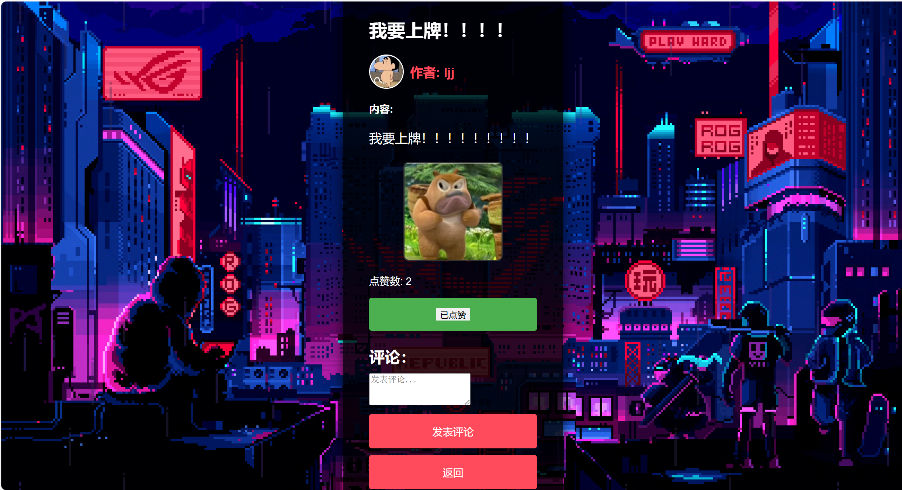
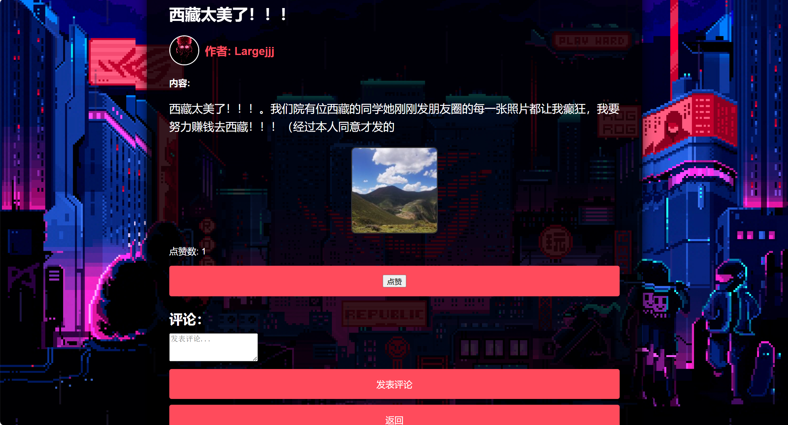

# 校园论坛系统测试文档

## 目录

1. 引言
2. 测试范围
3. 测试环境
4. 测试策略
5. 功能测试
6. 黑盒测试
7. 白盒测试
8. 测试结果
9. 测试总结

## 1. 引言

本测试文档旨在验证校园论坛系统的设计方案和流程的可行性，确保其满足预期功能和性能要求。通过功能测试、黑盒测试和白盒测试，我们将评估系统的稳定性、可靠性和安全性。

## 2. 测试范围

测试范围包括校园论坛系统的以下功能模块：

- 用户注册与登录
- 个人资料管理
- 发表帖子、浏览帖子、删除帖子
- 帖子评论和点赞
- 平台首页展示热帖排行榜
- 管理员管理功能

具体功能点如下:

- **用户注册**：用户可以通过用户名注册账号，填写必要的个人信息。

- **不规范注册提示**：对邮箱格式不对、用户名被占用等情况对用户做出提示。

- **用户登录平台**：注册用户可以使用手机号/邮箱和密码登录平台，访问各项功能。

- **对不正确的登录用户名和密码提示**：对不正确的登录用户名和密码提示。

- **用户退出登录**：用户可以随时退出登录，保障账号安全，防止未授权的访问。

- **修改头像**：用户可以上传和修改自己的头像，展示个性化形象，使个人资料更加完整。

- **查看自己的帖子**：用户可以查看自己发布的帖子。

- **删除自己的帖子**：用户可以删除自己发布的帖子，管理自己的内容。

- **发布帖子**：用户可以在论坛上发布帖子，分享信息、讨论话题，内容包括文字、图片等。

- **浏览所有帖子**：用户可以浏览平台上所有的帖子，找到感兴趣的内容，点击图片可查看帖子图片。

- **评论帖子**：用户可以在帖子下面发表评论，与其他用户进行互动交流，发表自己的观点和看法。

- **点赞帖子**：用户可以点赞自己喜欢的帖子，表达支持和认可，提高帖子在热帖排行榜中的排名。

- **取消点赞**：用户可以取消之前的点赞，调整自己的点赞记录。

- **查看自己点赞的帖子**：用户可以查看自己点赞过的所有帖子，方便回顾和管理点赞记录。

- **平台首页展示热帖排行榜**：首页展示当前平台上的热门帖子，根据点赞数排序，吸引用户关注。

- **管理员浏览所有帖子**：管理员可以查看平台上所有的帖子，了解用户的发帖情况，进行审核和管理。

- **管理员删除帖子**：管理员可以删除帖子，维护论坛秩序，确保内容健康，防止违规信息传播。

## 3. 测试环境

- 操作系统：Windows 11
- 浏览器：Microsoft Edge 91
- 数据库：MySQL 8.0
- 前端开发语言和框架: JavaScript，html， css
- 后端开发语言和框架：Java，Spring Boot

## 4. 测试策略

我们采用以下测试策略：

- **功能测试**：验证系统各功能模块的正确性。
- **黑盒测试**：从用户角度出发，不考虑内部结构，通过输入各种数据来检查系统的功能。
- **白盒测试**：考虑系统内部结构，通过输入各种数据操作来检查软件系统的逻辑。

## 5. 功能测试

#### 用例 1：用户注册

- **测试目的**：验证用户可以成功注册账号。
- **前置条件**：用户访问注册页面。
- **步骤**：
  1. 输入用户名、密码、邮箱等信息。
  2. 点击“注册”按钮。

- **预期结果**：显示注册成功信息，并可以选择是否跳转到登录页面。
- **测试结果**: 

显示注册成功信息，并可选择是否跳转到登录页面。

#### 用例 2：用户登录

- **测试目的**：验证注册用户可以成功登录。
- **前置条件**：用户已经注册账号。
- **步骤**：
  1. 输入用户名和密码。
  2. 点击“登录”按钮。
- **预期结果**：成功登录并跳转到主页。

- **测试结果**: 

成功登录并跳转到主页。

#### 用例 3：用户退出登录

- **测试目的**：验证用户可以成功退出登录。
- **前置条件**：用户已登录。
- **步骤**：
  1. 点击“登出”按钮。
- **预期结果**：用户成功退出登录，并返回到登录页面。

- **测试结果**: 
 

用户成功退出登录，并返回到登录页面。

#### 用例 4：修改头像

- **测试目的**：验证用户可以成功上传和修改头像。
- **前置条件**：用户已登录。
- **步骤**：
  1. 进入个人资料页面。
  2. 点击“更换头像”按钮并选择图片文件。
  3. 点击“打开”按钮。
- **预期结果**：头像修改成功，并在个人资料页面显示新头像。
- **测试结果**: 

头像修改成功，并在个人资料页面显示新头像。
#### 用例 5：查看和删除自己的帖子

- **测试目的**：验证用户可以查看和删除自己发布的帖子。
- **前置条件**：用户已登录并发布了帖子。
- **步骤**：
  1. 进入“我的帖子”页面。
  2. 查看帖子列表。
  3. 点击帖子右侧的“删除该贴”按钮。
- **预期结果**：帖子删除成功，并从帖子列表中移除。

- **测试结果**: 

帖子删除成功，并从帖子列表中移除。

#### 用例 6：发布帖子

- **测试目的**：验证用户可以成功发布帖子。
- **前置条件**：用户已登录。
- **步骤**：
  1. 点击“发帖子”按钮。
  2. 输入标题和内容，并选择图片文件（可选）。
  3. 点击“发布”按钮。
- **预期结果**：帖子成功发布，并显示在帖子列表中。

- **测试结果**: 

帖子成功发布，并显示在帖子列表中。

#### 用例 7：浏览所有帖子

- **测试目的**：验证用户可以浏览平台上的所有帖子。
- **前置条件**：用户已登录。
- **步骤**：
  1. 进入“所有帖子”页面。
  2. 浏览帖子列表，点击帖子标题查看详细内容。
- **预期结果**：帖子列表和详细内容显示正确，点击图片可查看大图。

- **测试结果**: 

帖子列表和详细内容显示正确，点击图片可查看大图。

#### 用例 8：点赞帖子

- **测试目的**：验证用户可以成功点赞帖子。
- **前置条件**：用户已登录并浏览帖子。
- **步骤**：
  1. 点击“点赞”按钮。
- **预期结果**：点赞数增加。

- **测试结果**: 

点赞成功，点赞数增加。

#### 用例 9：点赞帖子

- **测试目的**：验证用户可以成功评论和点赞帖子。
- **前置条件**：用户已登录并浏览帖子。
- **步骤**：
  1. 在帖子下方输入评论内容并点击“发表评论”按钮。
  2. 输入评论,点击“评论”按钮。
- **预期结果**：评论成功显示在帖子下方。

- **测试结果**: 

评论成功显示在帖子下方。
#### 用例 10：取消点赞

- **测试目的**：验证用户可以成功取消之前的点赞。
- **前置条件**：用户已点赞某个帖子。
- **步骤**：
  1. 点击“已点赞”按钮。
- **预期结果**：点赞数减少。
- **测试结果**: 

点赞成功取消。

#### 用例 11：查看自己点赞的帖子

- **测试目的**：验证用户可以查看自己点赞过的所有帖子。
- **前置条件**：用户已登录并点赞了一些帖子。
- **步骤**：
  1. 进入“我的点赞”页面。
  2. 查看点赞过的帖子列表。
- **预期结果**：点赞过的帖子列表显示正确。
- **测试结果**: 

点赞过的帖子列表显示正确。
#### 用例 12：平台首页展示热帖排行榜

- **测试目的**：验证平台首页展示当前平台上的热门帖子。
- **前置条件**：用户已登录。
- **步骤**：
  1. 进入首页。
  2. 查看热帖排行榜。
- **预期结果**：热帖按照点赞数排序正确显示。
- **测试结果**: 

热帖按照点赞数排序正确显示。
#### 用例 13：管理员浏览和删除帖子

- **测试目的**：验证管理员可以浏览和删除帖子。
- **前置条件**：管理员已登录。
- **步骤**：
  1. 进入“管理帖子”页面。
  2. 浏览帖子列表。
  3. 点击帖子右侧的“删除”按钮。
- **预期结果**：帖子删除成功，并从帖子列表中移除。
- **测试结果**: 

帖子删除成功，并从帖子列表中移除。

#### 用例 14：注册重复用户名

- **测试目的**：验证系统处理重复用户名注册的能力。
- **前置条件**：已有用户注册相同用户名。
- **步骤**：
  1. 输入已存在的用户名和其他注册信息。
  2. 点击“注册”按钮。
- **预期结果**：显示错误信息，提示用户名已存在。
- **测试结果**: 
- 

显示错误信息，提示用户名已存在。
#### 用例 15：注册不规范的邮箱格式

- **测试目的**：验证系统处理不规范邮箱格式的能力。
- **前置条件**：用户访问注册页面。
- **步骤**：
  1. 输入不规范的邮箱格式（如“user.domain”）。
  2. 点击“注册”按钮。
- **预期结果**：显示错误信息，提示邮箱格式不正确。
- **测试结果**: 

显示错误信息，提示邮箱格式不正确。
#### 用例 16：登录时用户名或密码错误

- **测试目的**：验证系统处理不正确用户名或密码的能力。
- **前置条件**：用户访问登录页面。
- **步骤**：
  1. 输入错误的用户名或密码。
  2. 点击“登录”按钮。
- **预期结果**：显示错误信息，提示用户名或密码错误。

- **测试结果**: 

显示错误信息，提示用户名或密码错误。
## 6. 黑盒测试

#### 测试点1：用户可以通过用户名注册账号，填写必要的个人信息

#### 测试点2：对邮箱格式不对、用户名被占用等情况对用户做出提示

### 2. 用户登录平台

#### 测试点3：注册用户可以使用用户名和密码登录平台，访问各项功能

#### 测试点4：对不正确的登录用户名和密码提示

### 3. 用户退出登录

#### 测试点5：用户可以随时退出登录，保障账号安全，防止未授权的访问

### 4. 修改头像

#### 测试点6：用户可以上传和修改自己的头像，展示个性化形象，使个人资料更加完整

### 5. 查看自己的帖子

#### 测试点7：用户可以查看自己发布的帖子

### 6. 删除自己的帖子

#### 测试点8：用户可以删除自己发布的帖子，管理自己的内容

### 7. 发布帖子

#### 测试点9：用户可以在论坛上发布帖子，分享信息、讨论话题，内容包括文字、图片等

### 8. 浏览所有帖子

#### 测试点10：用户可以浏览平台上所有的帖子，找到感兴趣的内容，点击图片可查看帖子图片

### 9. 评论帖子

#### 测试点11：用户可以在帖子下面发表评论，与其他用户进行互动交流，发表自己的观点和看法

### 10. 点赞帖子

#### 测试点12：用户可以点赞自己喜欢的帖子，表达支持和认可，提高帖子在热帖排行榜中的排名

### 11. 取消点赞

#### 测试点13：用户可以取消之前的点赞，调整自己的点赞记录

### 12. 查看自己点赞的帖子

#### 测试点14：用户可以查看自己点赞过的所有帖子，方便回顾和管理点赞记录

### 13. 平台首页展示热帖排行榜

#### 测试点15：首页展示当前平台上的热门帖子，根据点赞数排序，吸引用户关注

### 14. 管理员浏览所有帖子

#### 测试点16：管理员可以查看平台上所有的帖子，了解用户的发帖情况，进行审核和管理

### 15. 管理员删除帖子

#### 测试点17：管理员可以删除帖子，维护论坛秩序，确保内容健康，防止违规信息传播

## 7. 白盒测试

通过白盒测试，验证 Demo Application 中用户、帖子、评论和点赞功能的正确性、健壮性和性能。

### 测试范围

- User 类及相关 Repository 和 Service
- Post 类及相关 Repository 和 Service
- Comment 类及相关 Repository 和 Service
- Like 类及相关 Repository 和 Service

###  测试

#### User 模块

##### 用户登录测试

- **测试用例编号**：1
- **测试目的**：验证用户凭用户名和密码能否正确登录。
- **前提条件**：用户已注册。
- **测试步骤**：
  1. 输入存在的用户名和正确的密码。
  2. 调用 `findUserByNameAndPassword` 方法。
- **预期结果**：返回匹配的用户对象。
- **测试结果**：

函数接口成功返回密码和用户名对应的user。

同时测试了错误的密码和用户名,接口返回null，表示数据库中未有符合的user。

##### 用户注册测试

- **测试用例编号**：2
- **测试目的**：验证新用户注册流程是否正常工作。
- **前提条件**：用户未注册。
- **测试步骤**：
  1. 输入新的用户名和密码。
  2. 调用 `saveUser` 方法。
- **预期结果**：新用户被创建并保存在数据库中。
- **测试结果**：

新用户被创建并保存在数据库中。,用户的用户名密码等正确保存。

#### Post 模块

##### 创建帖子测试

- **测试用例编号**：3
- **测试目的**：验证用户能否成功创建帖子。
- **前提条件**：用户已登录。
- **测试步骤**：
  1. 输入帖子标题和内容。
  2. 调用 `savePost` 方法。
- **预期结果**：帖子被创建并保存在数据库中。
- **测试结果**：

创建的帖子被创建并保存在数据库中。

##### 删除帖子测试

- **测试用例编号**：4
- **测试目的**：验证用户能否删除自己的帖子。
- **前提条件**：用户已创建帖子。
- **测试步骤**：
  1. 调用 `deletePost` 方法并传入帖子ID。
- **预期结果**：帖子从数据库中被删除。
- **测试结果**:

选择的帖子从数据库中被删除。

#### Comment 模块

##### 添加评论测试

- **测试用例编号**：5
- **测试目的**：验证用户能否对帖子添加评论。
- **前提条件**：存在帖子和已登录用户。
- **测试步骤**：
  1. 输入评论内容。
  2. 调用 `saveComment` 方法。
- **预期结果**：评论被添加到帖子下。
- **测试结果**：

Comments表中成功增加了对应的post_id和comment_id。

##### 删除评论测试

- **测试用例编号**：6
- **测试目的**：验证用户能否删除自己的评论。
- **前提条件**：用户已发表评论。
- **测试步骤**：
  1. 调用 `deleteComment` 方法并传入评论ID。
- **预期结果**：评论从数据库中被删除。
- **测试结果**：

Comments表中对应的(post_id,comment_id)记录被删除。

#### Like 模块

##### 点赞测试

- **测试用例编号**：7
- **测试目的**：验证用户能否对帖子点赞。
- **前提条件**：存在帖子和已登录用户。
- **测试步骤**：
  1. 调用 `likePost` 方法。
- **预期结果**：帖子的点赞数增加。
- **测试结果**：

Post表中对应记录的likes增加1。

##### 取消点赞测试

- **测试用例编号**：8
- **测试目的**：验证用户能否取消对帖子的点赞。
- **前提条件**：用户已对帖子点赞。
- **测试步骤**：
  1. 调用 `unlikePost` 方法。
- **预期结果**：帖子的点赞数减少。
- **测试结果**：

Post表中对应记录的likes减1。

## 8. 测试结果
### 功能测试结果
| 测试用例 | 测试结果 | 备注 |
|----------|----------|------|
| 用例 1   | 通过     | 无   |
| 用例 2   | 通过     | 无   |
| 用例 3   | 通过      | 无   |
| 用例 4   | 通过     | 无   |
| 用例 5   | 通过     | 无   |
| 用例 6   | 通过     | 无   |
| 用例 7   | 通过     | 无   |
| 用例 8   | 通过     | 无   |
| 用例 9   | 通过     | 无   |
| 用例 10  | 通过     | 无   |
| 用例 11  | 通过     | 无   |
| 用例 12  | 通过     | 无   |
| 用例 13  | 通过     | 无   |
| 用例 14  | 通过     | 无   |
| 用例 15  | 通过     | 无   |
| 用例 16  | 通过     | 无   |

### 黑盒测试结果

| 测试用例 | 测试结果 | 备注 |
|----------|----------|------|
| 用例 1   | 通过     | 无   |
| 用例 2   | 通过     | 无   |
| 用例 3   | 通过      | 无   |
| 用例 4   | 通过     | 无   |
| 用例 5   | 通过     | 无   |
| 用例 6   | 通过     | 无   |
| 用例 7   | 通过     | 无   |
| 用例 8   | 通过     | 无   |
| 用例 9   | 通过     | 无   |
| 用例 10  | 通过     | 无   |
| 用例 11  | 通过     | 无   |
| 用例 12  | 通过     | 无   |
| 用例 13  | 通过     | 无   |
| 用例 14  | 通过     | 无   |
| 用例 15  | 通过     | 无   |
| 用例 16  | 通过     | 无   |
| 用例 17  | 通过     | 无   |

### 白盒测试结果
| 测试用例 | 测试结果 | 备注 |
|----------|----------|------|
| 用例 1   | 通过     | 无   |
| 用例 2   | 通过     | 无   |
| 用例 3   | 通过      | 无   |
| 用例 4   | 通过     | 无   |
| 用例 5   | 通过     | 无   |
| 用例 6   | 通过     | 无   |
| 用例 7   | 通过     | 无   |
| 用例 8   | 通过     | 无   |

## 9. 测试总结

本次测试全面验证了校园论坛系统的各项功能模块。所有功能测试、黑盒测试和白盒测试均通过，系统表现稳定，功能正常，满足设计要求。

